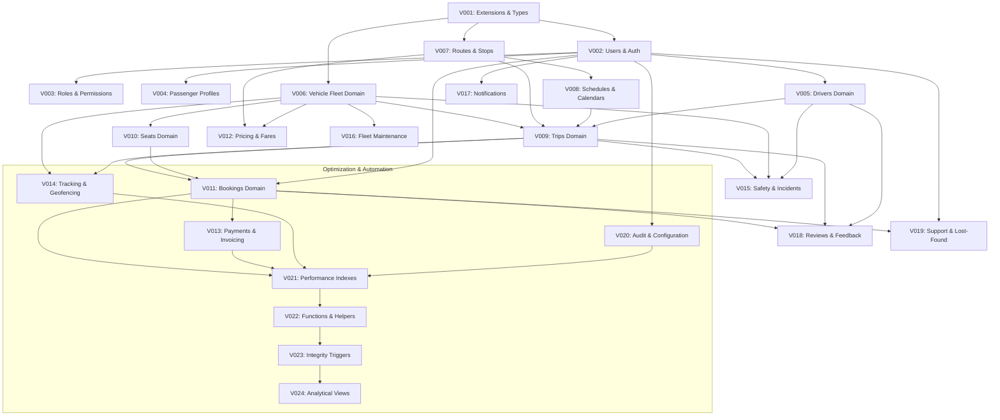

# Movana Database Migration Execution Plan & Version Control

This document governs the execution sequence, dependency graph, verification gates, and rollback procedures for version-controlled database migrations on **PostgreSQL 16**.

---

## 1. Migration Engineering Rules

1. **Strict Target Verification**: Every migration runner script must assert that `current_database() = 'movana'` before issuing any DDL statements. Any session connected to any other database is aborted immediately.
2. **Strict Sequential Execution**: Migrations are strictly numbered `V001` through `V024`. No migration may be executed out of sequence.
3. **Atomic Execution**: Every migration script is wrapped in a single explicit transaction:
   ```sql
   BEGIN;
   -- Migration DDL
   COMMIT;
   ```
4. **Idempotence & Safety**: Tables and constraints utilize `IF NOT EXISTS` / `ADD CONSTRAINT` with defensive error handling to prevent broken rerun attempts.
5. **No Blind Destructive Actions**: Dropping tables or cascades is strictly prohibited. Alterations must be staged through additive forward migrations.

---

## 2. Migration Dependency & Sequencing Matrix



---

## 3. Migration Manifest & Detailed Inventory

| File | Target Domain | Key Tables / Objects Created |
| :--- | :--- | :--- |
| `V001__extensions.sql` | Foundation | `pgcrypto`, `btree_gist`, `citext`, `schema_migrations`, `fn_set_updated_at` |
| `V002__users.sql` | Identity & Auth | `users`, `user_sessions`, `login_attempts`, `security_events`, `password_reset_tokens`, `email_verification_tokens` |
| `V003__roles_permissions.sql` | RBAC | `roles`, `permissions`, `user_roles`, `role_permissions` |
| `V004__passenger_profiles.sql` | Profiles | `passenger_profiles`, `user_preferences` |
| `V005__emergency_contacts.sql` | Contacts & Address| `emergency_contacts`, `user_addresses` |
| `V006__drivers.sql` | Driver Compliance | `drivers`, `driver_availability`, `driver_status_history`, `driver_emergency_contacts`, `driver_assignments` |
| `V007__driver_documents.sql` | Compliance Files | `driver_document_types`, `driver_documents`, `driver_verifications` |
| `V008__vehicles.sql` | Bus Fleet | `vehicle_manufacturers`, `vehicle_models`, `vehicle_types`, `vehicles`, `vehicle_status_history`, `vehicle_assignments` |
| `V009__vehicle_documents.sql` | Bus Compliance | `vehicle_documents` (fitness, permit, RC, insurance) |
| `V010__vehicle_maintenance.sql`| Garage Operations | `maintenance_schedules`, `maintenance_records`, `maintenance_items`, `maintenance_parts`, `vehicle_inspections`, `vehicle_inspection_items`, `vehicle_inspection_issues` |
| `V011__seat_layouts.sql` | Seating Grids | `seat_layouts`, `seats` (decks, window/aisle, types) |
| `V012__routes_stops.sql` | Transit Network | `stops`, `routes`, `route_versions`, `route_stops` |
| `V013__schedules_calendars.sql`| Service Timetables| `service_calendars`, `service_calendar_exceptions`, `trip_schedules`, `schedule_stops` |
| `V014__trips.sql` | Trip Operations | `trips`, `trip_stops`, `trip_assignments`, `trip_status_history`, `trip_events`, deferred FKs to `trips` |
| `V015__bookings.sql` | Reservations | `bookings`, `booking_passengers`, `booking_items`, `booking_seats` (concurrency shield), cancellations, reschedules |
| `V016__fares_pricing.sql` | Fares & Discounts | `fare_products`, `fare_rules`, `fare_prices`, `trip_fares`, `discounts`, `coupons`, `coupon_redemptions` |
| `V017__payments_refunds.sql` | Financial Ledger | `payment_methods`, `payments`, `payment_attempts`, `payment_transactions`, `payment_events`, `refunds`, `invoices`, items |
| `V018__gps_tracking.sql` | Telemetry & Fences| `tracking_devices`, `vehicle_location_history` (range partitioned with default partition), `tracking_events`, `geofences`, `geofence_events` |
| `V019__safety_incidents.sql` | Safety & SOS | `incident_types`, `incident_severity_levels`, `incidents`, `incident_reports`, `incident_actions`, `emergency_events`, `driver_safety_events` |
| `V020__notifications.sql` | Communications | `notification_templates`, `notification_preferences`, `notifications`, `notification_deliveries` |
| `V021__reviews_support_lost_found.sql`| Customer Care| `review_categories`, `reviews`, `responses`, `support_tickets`, messages, `lost_found_reports`, `lost_found_items` |
| `V022__audit_security.sql` | Audit Trail | `audit_logs`, `fn_record_audit_log`, `fn_generate_booking_reference`, `fn_calculate_trip_available_seats`, triggers |
| `V023__settings_attachments.sql`| Config & Files | `file_attachments`, `system_settings`, `feature_flags`, deferred FK for `support_ticket_attachments` |
| `V024__views.sql` | Analytical Views | 8 Reporting projections (`vw_available_trip_seats`, `vw_trip_current_status`, `vw_booking_summary`, `vw_payment_summary`...) |

---

## 4. Pre-Flight Verification Gate

Before running the migration suite, execute:
```sql
SELECT 
    current_database() AS target_db,
    current_user AS migration_runner,
    version() AS pg_engine,
    CASE 
        WHEN current_database() = 'movana' THEN 'TARGET_CONFIRMED_SAFE'
        ELSE 'ABORT_INCORRECT_DATABASE'
    END AS safety_status;
```
If `safety_status` is anything other than `TARGET_CONFIRMED_SAFE`, execution halts immediately.

---

## 5. Seed Data Strategy

After migrations are validated:
1. `reference_data.sql`:
   * Seeds immutable operational definitions (Roles: `ADMIN`, `OPERATOR`, `DRIVER`, etc.; Permissions; Vehicle Types; Incident Types; Document Types; Default System Settings).
   * Fully deterministic and idempotent via `ON CONFLICT DO NOTHING`.
2. `development_data.sql`:
   * Seeds realistic demo data: Fictional routes (e.g. Bangalore to Chennai, Mumbai to Pune), demo bus fleet, simulated drivers, sample trips, and test bookings.
   * Clearly marked with `is_demo = true` or test prefixes. Contains zero real personal data.
