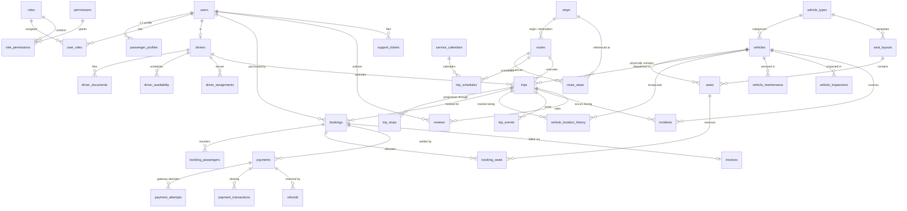

# Movana Database Relationships & Referential Integrity Architecture

This document maps all entity-relationship topologies, cardinality constraints, foreign key cascades, and deletion protection rules across the **Movana** platform.

---

## 1. Referential Integrity & Foreign Key Policy

Movana enforces strict referential integrity at the PostgreSQL engine level. Deletion behavior is classified into three deliberate tiers:

### 1.1 `ON DELETE RESTRICT` (The Financial & Operational Safe Harbor)
Used for all transactional and regulatory assets. You cannot delete a parent entity if historical transactions depend on it:
* Users with historical Bookings, Payments, Invoices, Safety Incidents, or Audit logs.
* Routes, Vehicles, or Drivers assigned to completed Trips.
* Payment transactions linked to Invoices or Refunds.
* Stops linked to historical Trips or Route definitions.

### 1.2 `ON DELETE CASCADE` (Tightly Bound Subordinate Entities)
Used strictly where a child entity has zero standalone operational or regulatory meaning outside its parent:
* `user_sessions`, `password_reset_tokens`, `email_verification_tokens` (cascade when `users` is permanently expunged).
* `passenger_profiles`, `emergency_contacts`, `user_addresses`, `user_preferences` (cascade with `users`).
* `route_stops` (cascade when a draft `routes` entity is pruned).
* `booking_passengers`, `booking_items`, `booking_seats` (cascade when an unconfirmed draft `bookings` is removed).
* `maintenance_items`, `maintenance_parts` (cascade when a parent work order is cleared).

### 1.3 `ON DELETE SET NULL` (Disassociated Audit Tracking)
Used where parent links provide contextual attribution that should be nullified if the actor or secondary entity is detached:
* `trips.secondary_driver_id` (if secondary relief driver is removed).
* `support_tickets.assigned_to` (if an agent account is retired).
* `audit_logs.actor_user_id` (preserves historical system log even if the actor account is purged).

---

## 2. Core Domain Relationship Diagram (Mermaid ERD)

---

## 3. High-Value Relational Cardinality Catalog

| Parent Table | Child Table | Cardinality | FK Column | Cascade Action | Operational Rationale |
| :--- | :--- | :---: | :--- | :--- | :--- |
| `users` | `passenger_profiles` | 1:1 | `user_id` | `CASCADE` | Direct profile extension of user account |
| `users` | `drivers` | 1:1 | `user_id` | `RESTRICT` | Prevent deletion of user if active commercial driver |
| `users` | `bookings` | 1:N | `user_id` | `RESTRICT` | Financial records must not be orphaned |
| `users` | `audit_logs` | 1:N | `actor_user_id` | `SET NULL` | Audit records must remain intact if user is expunged |
| `roles` | `user_roles` | 1:N | `role_id` | `RESTRICT` | Cannot drop role while users are assigned to it |
| `vehicles` | `seats` | 1:N | `vehicle_id` | `CASCADE` | Seat layout destroyed if physical bus is scrapped |
| `routes` | `route_stops` | 1:N | `route_id` | `CASCADE` | Route topology strictly dependent on route master |
| `stops` | `route_stops` | 1:N | `stop_id` | `RESTRICT` | Active bus stop cannot be dropped if in routes |
| `trips` | `trip_stops` | 1:N | `trip_id` | `CASCADE` | Stop timeline belongs to trip instance |
| `trips` | `bookings` | 1:N | `trip_id` | `RESTRICT` | Cannot cancel or drop trip with active paid bookings |
| `bookings` | `booking_seats` | 1:N | `booking_id` | `CASCADE` | Reserved seat entries belong to parent order |
| `seats` | `booking_seats` | 1:N | `seat_id` | `RESTRICT` | Cannot delete physical seat if referenced by active booking |
| `bookings` | `payments` | 1:N | `booking_id` | `RESTRICT` | Financial ledger must never be accidentally dropped |
| `payments` | `refunds` | 1:N | `payment_id` | `RESTRICT` | Complete reversal audit trail required |
| `bookings` | `invoices` | 1:1 | `booking_id` | `RESTRICT` | Immutable tax invoices must survive cancellations |
| `vehicles` | `vehicle_location_history` | 1:N | `vehicle_id` | `RESTRICT` | Telemetry must be retained for fleet audits |
| `incidents` | `incident_reports` | 1:N | `incident_id` | `CASCADE` | Reports are subordinate to incident master |
| `maintenance_records` | `maintenance_items` | 1:N | `maintenance_record_id` | `CASCADE` | Items are subcomponents of maintenance order |
