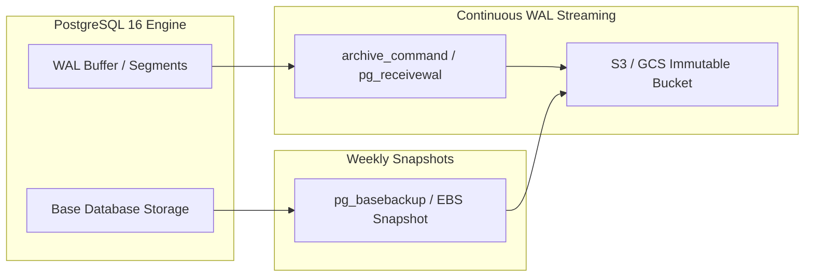

# Movana Database Backup, Verification & Recovery Runbook

**Target Database**: PostgreSQL 16 (`movana`)  
**Host / Port**: `localhost:5432`  
**Classification**: Production-Grade Disaster Recovery & Operational Runbook  
**Last Updated**: September 2026  
**Status**: APPROVED

---

## 1. Architectural Overview & Backup Strategy

The Movana database hosts the transit platform's core operational entities: bookings, passenger accounts, driver credentials, vehicle telematics, route schedules, geospatial shapes, and fiscal transaction ledgers. Maintaining deterministic, consistent, and verifiable backups is essential to operational resilience.

### 1.1 Multi-Database Instance Isolation

The local PostgreSQL 16 cluster hosts multiple independent databases (e.g., `movana`, `movana_db`, `localhero_db`, `chatbot_db`, `cyber_investigation`, `dayflow`, `maritime_m3_db`, `skillbridge_ai`).

> [!CAUTION]
> **Strict Isolation Directive**:
> - Never execute instance-wide `pg_dumpall` or wildcard maintenance scripts. Doing so can capture or overwrite neighboring databases.
> - Every backup, restore, and inspection command must be explicitly constrained to database `movana` (`-d movana`).
> - The automated backup script (`scripts/database/backup-movana.ps1`) enforces this restriction with an immutable read-only variable `TargetDatabase = "movana"` and aborts if `SELECT current_database()` returns any other value.

---

### 1.2 Archive Format Decision: PostgreSQL Custom Format (`-F c`)

All full backups for the Movana database are standardized on the PostgreSQL Custom Format (`-F c` / `--format=custom`).

| Metric | Plain SQL Dump (`-F p`) | PostgreSQL Custom Format (`-F c`) |
| :--- | :--- | :--- |
| **Compression** | None (requires external `gzip`/`pigz`) | Built-in native zlib compression |
| **Restoration Tool** | `psql` | `pg_restore` |
| **Selective Table Restore** | Requires parsing/regex editing | Native via `-t <table>` or `-L <listfile>` |
| **Parallel Restoration** | No (single-threaded stream) | Yes via multi-worker threads (`pg_restore -j <N>`) |
| **TOC Inspection** | Must read entire plain SQL text | Instant inspection via `pg_restore -l <dump>` |
| **Reordering Capabilities** | Fixed statement order | Objects can be reordered to satisfy dependencies |
| **Large Object Support** | Emits hex/escape strings | Binary streaming (`-b` / `--blobs`) |
| **Safety** | Errors in stream can leave partial schema | Structured archive with granular error control |

**Technical Justification for Movana**:
1. **Partitioning & Dependency Management**: Movana contains declarative range partitioning (`audit_logs` with 16 partitions), 73 triggers, 278 stored procedures/functions, and 181 foreign key constraints. The custom format permits `pg_restore` to decouple schema creation, data loading, constraint validation, and index generation into optimal execution orders.
2. **Deterministic Pre-Restore Inspection**: Custom archives allow non-destructive catalog verification using `pg_restore -l` to verify table of contents integrity without executing any SQL on the engine.
3. **Storage Efficiency**: Movana development and extended seed data compress by 70–85% compared to raw SQL text.

---

## 2. Backup Directory & Sidecar Metadata Standards

### 2.1 File System Topology

Backups and their cryptographic manifests are stored in the repository's dedicated database backup directory:

```text
Movana/
└── backups/
    └── database/
        ├── movana_backup_20260930_120000.dump   <-- PostgreSQL Custom Archive (-F c)
        ├── movana_backup_20260930_120000.json   <-- Machine-readable JSON metadata sidecar
        └── ...
```

### 2.2 Filename Convention

```text
movana_backup_<YYYYMMDD>_<HHMMSS>[_<Label>].dump
movana_backup_<YYYYMMDD>_<HHMMSS>[_<Label>].json
```

- **Timestamp**: Local execution timestamp in `yyyyMMdd_HHmmss` format.
- **Label (Optional)**: Descriptive tag for the operational milestone (e.g., `pre_migration_v025`, `post_extended_seed`, `golden_baseline`).
- **File Overwrite Protection**: The backup utility enforces an overwrite check and will immediately abort if a backup archive with the target filename already exists on disk.

### 2.3 Sidecar Metadata Schema (`.json`)

Every backup execution generates a paired JSON metadata sidecar containing complete audit trails:

```json
{
  "backup_filename": "movana_backup_20260930_120000_golden_baseline.dump",
  "backup_file_path": "C:\\Users\\Manoj\\OneDrive\\Desktop\\Movana\\backups\\database\\movana_backup_20260930_120000_golden_baseline.dump",
  "database_name": "movana",
  "host": "localhost",
  "port": 5432,
  "user": "postgres",
  "timestamp_utc": "2026-09-30T06:30:00Z",
  "timestamp_local": "2026-09-30 12:00:00 +05:30",
  "execution_duration_sec": 4.12,
  "format": "PostgreSQL Custom Format (-F c)",
  "pg_dump_version": "pg_dump (PostgreSQL) 16.13",
  "postgresql_engine_version": "PostgreSQL 16.13, compiled by Visual C++ build 1943, 64-bit",
  "file_size_bytes": 1845248,
  "file_size_mb": 1.76,
  "sha256_checksum": "E3B0C44298FC1C149AFBF4C8996FB92427AE41E4649B934CA495991B7852B855",
  "toc_entry_count": 894,
  "database_metrics_at_backup": {
    "successful_migrations": 24,
    "base_tables": 109,
    "views": 8,
    "functions_procedures": 278,
    "triggers": 73,
    "indexes": 342,
    "foreign_keys": 181,
    "partitioned_tables": 1,
    "child_partitions": 16
  }
}
```

---

## 3. How to Create a Backup

### 3.1 Method A: Using the Automated PowerShell Utility (Recommended)

The project includes an audited, hardened backup utility: [`scripts/database/backup-movana.ps1`](file:///c:/Users/Manoj/OneDrive/Desktop/Movana/scripts/database/backup-movana.ps1).

#### Step-by-Step Pre-Flight Protections:
1. Verifies `pg_dump`, `pg_restore`, and `psql` are present in `PATH`.
2. Queries `SELECT current_database()` and halts if the database is NOT `movana`.
3. Collects database state metrics (migrations, base tables, views, functions, triggers, indexes, foreign keys, partitions).
4. Emits `pg_dump` with custom format flags (`-F c -b -v`).
5. Validates non-zero output file length.
6. Computes SHA-256 hash.
7. Validates archive Table of Contents with `pg_restore -l`.
8. Emits structured JSON metadata sidecar.

#### Execution Syntax:

```powershell
# Standard baseline backup with default settings (Host: localhost, Port: 5432, User: postgres)
powershell -ExecutionPolicy Bypass -File scripts/database/backup-movana.ps1

# Backup with custom label
powershell -ExecutionPolicy Bypass -File scripts/database/backup-movana.ps1 -Label "golden_seed_verified"

# Backup with explicit credentials and host parameters
powershell -ExecutionPolicy Bypass -File scripts/database/backup-movana.ps1 -HostName "localhost" -Port 5432 -User "postgres" -Label "pre_release"
```

---

### 3.2 Method B: Manual Command-Line Execution (`pg_dump`)

If executing manually from standard command line or bash/powershell without the automated script:

```powershell
# 1. Set environment variables (avoid hardcoding passwords on CLI)
$env:PGPASSWORD = "your_secure_password"

# 2. Confirm database identity before dump
psql -h localhost -p 5432 -U postgres -d movana -t -A -c "SELECT current_database();"

# 3. Create destination directory
New-Item -ItemType Directory -Force -Path "backups/database"

# 4. Generate timestamped dump
$TIMESTAMP = (Get-Date).ToString("yyyyMMdd_HHmmss")
pg_dump -h localhost -p 5432 -U postgres -d movana -F c -b -v -f "backups/database/movana_backup_$TIMESTAMP.dump"

# 5. Calculate SHA-256 hash
Get-FileHash -Path "backups/database/movana_backup_$TIMESTAMP.dump" -Algorithm SHA256

# 6. Verify Table of Contents
pg_restore -l "backups/database/movana_backup_$TIMESTAMP.dump" | Select-String -Pattern "^\s*\d+;" | Measure-Object
```

---

## 4. Backup Verification & Table of Contents (TOC) Inspection

A backup cannot be considered valid until its archive structure is cryptographically and logically verified.

### 4.1 Cryptographic Hash Verification
Verify that the on-disk file matches its recorded SHA-256 checksum:

```powershell
$dumpFile = "backups/database/movana_backup_20260930_120000.dump"
Get-FileHash -Path $dumpFile -Algorithm SHA256
```
Compare the output against the `sha256_checksum` key in the accompanying `.json` sidecar.

### 4.2 Non-Destructive Table of Contents Inspection (`pg_restore -l`)
Inspect all catalogued items inside the dump without touching any database:

```powershell
# List all TOC entries
pg_restore -l "backups/database/movana_backup_20260930_120000.dump"

# Filter by table definitions
pg_restore -l "backups/database/movana_backup_20260930_120000.dump" | Select-String "TABLE DATA"

# Count total catalogued items
(pg_restore -l "backups/database/movana_backup_20260930_120000.dump" | Where-Object { $_ -match '^\s*\d+;' }).Count
```

---

## 5. Safe Restoration Procedures & Recovery Runbook

> [!WARNING]
> ### The Dangers of `--clean` in Active Environments
> The legacy backup documentation recommended `pg_restore --clean --if-exists`. In production or active development, using `--clean` blindly is hazardous because:
> 1. `--clean` emits `DROP` statements for database objects before recreating them.
> 2. If dependencies (foreign keys, views, triggers) exist across objects or active sessions hold locks, drops can fail or cascade uncontrollably.
> 3. If the restore encounters an unrecoverable error halfway through, your original database is left in a corrupted, half-dropped state.
> 4. **Safe Standard**: NEVER run `--clean` directly against your live database. Instead, restore into a scratch/staging database first, or follow the isolated recovery procedures below.

---

### 5.1 Safe Restore Pattern: Staging Validation First (Golden Path)

Before restoring over an existing `movana` database, always validate the archive against a temporary verification database:

```powershell
# Step 1: Create an isolated scratch database
psql -h localhost -p 5432 -U postgres -d postgres -c "CREATE DATABASE movana_restore_test;"

# Step 2: Restore the dump into the scratch database
pg_restore -h localhost -p 5432 -U postgres -d movana_restore_test --no-owner --no-privileges -v "backups/database/movana_backup_20260930_120000.dump"

# Step 3: Run validation queries against scratch database
psql -h localhost -p 5432 -U postgres -d movana_restore_test -c "
SELECT 
    (SELECT count(*) FROM information_schema.tables WHERE table_schema = 'public' AND table_type = 'BASE TABLE') AS base_tables,
    (SELECT count(*) FROM schema_migrations WHERE success = TRUE) AS migrations,
    (SELECT count(*) FROM bookings) AS sample_booking_count;
"

# Step 4: Drop the temporary scratch database once verified
psql -h localhost -p 5432 -U postgres -d postgres -c "DROP DATABASE movana_restore_test;"
```

---

### 5.2 Clean Rebuild of the Live `movana` Database (Disaster Recovery)

If the live `movana` database has experienced catastrophic data corruption or requires full rollback to a backup checkpoint:

```powershell
# 1. Terminate all active client connections to 'movana'
psql -h localhost -p 5432 -U postgres -d postgres -c "
SELECT pg_terminate_backend(pid) 
FROM pg_stat_activity 
WHERE datname = 'movana' AND pid <> pg_backend_pid();
"

# 2. Drop and recreate the 'movana' database cleanly
psql -h localhost -p 5432 -U postgres -d postgres -c "DROP DATABASE movana;"
psql -h localhost -p 5432 -U postgres -d postgres -c "CREATE DATABASE movana WITH OWNER postgres ENCODING 'UTF8';"

# 3. Restore the custom archive into the fresh 'movana' database
# Options:
#   -v: Verbose output
#   --single-transaction: Wrap entire restore in a transaction (rolls back on fatal failure)
#   --no-owner: Preserves current user ownership
pg_restore -h localhost -p 5432 -U postgres -d movana --single-transaction --no-owner -v "backups/database/movana_backup_20260930_120000.dump"

# 4. Run post-restore integrity suite
powershell -ExecutionPolicy Bypass -File tests/database/integrity-suite.ps1
```

---

### 5.3 Selective Table Restoration

If an operator accidentally damaged or truncated a single table (e.g., `fare_rules` or `promo_codes`), you do not need to restore the whole database. Extract and restore only the target table:

```powershell
# Restore ONLY the table structure and data for 'fare_rules'
pg_restore -h localhost -p 5432 -U postgres -d movana -t fare_rules -v "backups/database/movana_backup_20260930_120000.dump"

# Restore ONLY data for 'promo_codes' without schema DDL
pg_restore -h localhost -p 5432 -U postgres -d movana -a -t promo_codes -v "backups/database/movana_backup_20260930_120000.dump"
```

---

### 5.4 Granular Control via TOC List (`-L` / `--use-list`)

For complex selective restores or skipping problematic items:

```powershell
# 1. Dump TOC to an editable text file
pg_restore -l "backups/database/movana_backup_20260930_120000.dump" > restore_toc.txt

# 2. Edit restore_toc.txt (comment out with ';' any items to skip)

# 3. Restore strictly according to the edited TOC list
pg_restore -h localhost -p 5432 -U postgres -d movana -L restore_toc.txt -v "backups/database/movana_backup_20260930_120000.dump"
```

---

## 6. Enterprise Disaster Recovery & Production WAL Archiving (PITR)

For production deployments hosted on AWS (RDS/Aurora) or bare-metal Linux clusters:



1. **Continuous WAL Archiving**:
   - `archive_mode = on`
   - `archive_command = 'envdir /etc/wal-e.d/env wal-g wal-push %p'` (or AWS RDS automated WAL archiving).
2. **Weekly Physical Base Backups**:
   - Automated physical volume snapshots or `pg_basebackup`.
3. **Point-In-Time Recovery (PITR)**:
   - Enables restoring the cluster to the exact second prior to an operational incident:
     ```text
     restore_command = 'wal-g wal-fetch %f %p'
     recovery_target_time = '2026-09-30 11:45:00 UTC'
     recovery_target_action = 'promote'
     ```

---

## 7. Operational Checklist & Runbook Summary

| Action | Command / Tool | Safety Gate |
| :--- | :--- | :--- |
| **Full Backup** | `scripts/database/backup-movana.ps1` | Automatic `SELECT current_database()` check, overwrite check |
| **Verify Integrity** | `Get-FileHash ... -Algorithm SHA256` | Compare against `.json` sidecar hash |
| **Inspect Contents** | `pg_restore -l <dump>` | Non-destructive; runs without connecting to database |
| **Pre-Restore Test** | Restore into `movana_restore_test` | Prevents live database corruption |
| **Full Restore** | `DROP DATABASE` + `CREATE DATABASE` + `pg_restore` | Terminate active connections first |
| **Selective Restore** | `pg_restore -t <table_name>` | Scoped strictly to target table |
