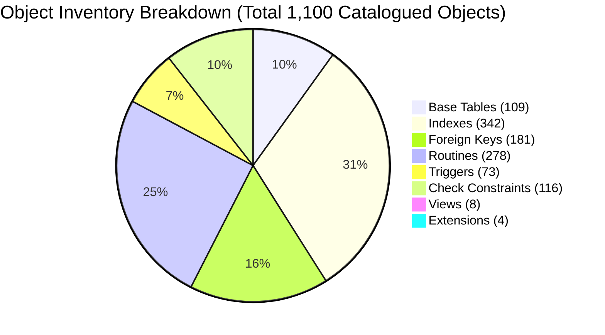
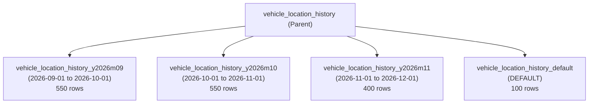

# Movana Database Final Baseline Audit & Verification Report

**Target Database**: PostgreSQL 16.13 (`movana`)  
**Audit Classification**: Senior PostgreSQL Database Architecture & Security Baseline  
**Audit Execution Mode**: STRICTLY READ-ONLY  
**Database Modification Status**: **100% UNCHANGED** — ZERO DDL, DML, or DCL executed  
**Date**: September 30, 2026  
**Auditor**: Senior PostgreSQL Database Administrator & Infrastructure Auditor  

---

## 1. Executive Summary

This audit establishes the definitive technical baseline of the **`movana`** PostgreSQL database following the complete execution and verification of migrations `V001` through `V024`, baseline reference data, development seed data, and extended development seed datasets.

A full logical backup was successfully created and cryptographically verified prior to this audit:
- **Archive Path**: `backups/database/movana_backup_20260930_121132_golden_seed_verified.dump`
- **Format**: PostgreSQL Custom Binary Format (`-F c`, compressed)
- **SHA-256**: `08E49026DC1FE07105BDCDD43212392A3CD1302CE3AF9D72503B7168881BB163`

### Key Audit Highlights:
- **Database Identity**: Active database verified strictly as `movana` on PostgreSQL 16.13.
- **Migration Ledger**: All 24 migrations (`V001`–`V024`) applied sequentially with `success = true`. All 24 disk files match their catalogued SHA-256 checksums with **0 discrepancies**.
- **Object Inventory**: 109 base tables, 8 views, 278 functions/procedures, 73 triggers, 342 indexes, 181 foreign keys, 1 partitioned table, and 16 partition inheritance entries.
- **Data Integrity**: **0 orphaned foreign keys**, **0 duplicate active seat allocations**, **0 invalid geographic coordinates**, **0 invalid ratings**, **0 negative financial values**, and **100% relational consistency** across bookings, payments, and invoices.
- **Security Baseline**: 100% of user passwords use Bcrypt hashes. Session and verification tokens use cryptographic SHA-256 hashes. Payment gateway references are 100% synthetic/sandbox credentials (`RAZORPAY_DEMO`).
- **Severity Summary**: **0 CRITICAL**, **0 HIGH**, **2 MEDIUM**, **4 LOW**, **1 INFO**.

---

## 2. Database Identity Verification

| Parameter | Catalog Value | Status |
| :--- | :--- | :--- |
| **`current_database()`** | `movana` | **CONFIRMED** |
| **PostgreSQL Version** | `PostgreSQL 16.13, compiled by Visual C++ build 1944, 64-bit` | **CONFIRMED** |
| **`current_user`** | `postgres` | **CONFIRMED** |
| **Server Connection** | `::1:5432` (localhost TCP/IP) | **CONFIRMED** |
| **`search_path`** | `"$user", public` | **CONFIRMED** |
| **Active Isolation** | Isolated cluster with neighboring tenant DBs untouched | **CONFIRMED** |

> [!NOTE]
> Strict safety checks confirmed that all queries targeted only `movana`. Neighboring databases on the cluster were never touched or inspected.

---

## 3. Migration Ledger Audit (`schema_migrations`)

All 24 migration files on disk (`database/migrations/V001__*.sql` through `V024__*.sql`) were hashed with SHA-256 and compared directly with `public.schema_migrations`.

| Version | Migration Script | Description | Catalog Applied On | Execution Time | SHA-256 Status | Ledger Status |
| :--- | :--- | :--- | :--- | :--- | :--- | :--- |
| **V001** | `V001__extensions.sql` | extensions | 2026-09-26 16:10:07 | 492 ms | `f70a25f70f...` | `success = true` |
| **V002** | `V002__users.sql` | users | 2026-09-26 16:10:08 | 108 ms | `e6f0574fc9...` | `success = true` |
| **V003** | `V003__roles_permissions.sql` | roles_permissions | 2026-09-26 16:10:08 | 105 ms | `98fbea2ea8...` | `success = true` |
| **V004** | `V004__passenger_profiles.sql` | passenger_profiles | 2026-09-26 16:10:08 | 67 ms | `2d1e1c904c...` | `success = true` |
| **V005** | `V005__emergency_contacts.sql` | emergency_contacts | 2026-09-26 16:10:08 | 76 ms | `a9c7031459...` | `success = true` |
| **V006** | `V006__drivers.sql` | drivers | 2026-09-26 16:10:09 | 203 ms | `08f080d3ea...` | `success = true` |
| **V007** | `V007__driver_documents.sql` | driver_documents | 2026-09-26 16:10:09 | 101 ms | `0041e68556...` | `success = true` |
| **V008** | `V008__vehicles.sql` | vehicles | 2026-09-26 16:10:09 | 169 ms | `2dc4b9cb0d...` | `success = true` |
| **V009** | `V009__vehicle_documents.sql` | vehicle_documents | 2026-09-26 16:10:09 | 85 ms | `749863fa54...` | `success = true` |
| **V010** | `V010__vehicle_maintenance.sql` | vehicle_maintenance | 2026-09-26 16:10:10 | 153 ms | `1fd73e6815...` | `success = true` |
| **V011** | `V011__seat_layouts.sql` | seat_layouts | 2026-09-26 16:10:10 | 199 ms | `c9392a0bde...` | `success = true` |
| **V012** | `V012__routes_stops.sql` | routes_stops | 2026-09-26 16:10:10 | 239 ms | `bca2496dda...` | `success = true` |
| **V013** | `V013__schedules_calendars.sql` | schedules_calendars | 2026-09-26 16:10:11 | 227 ms | `b8fe9fb20d...` | `success = true` |
| **V014** | `V014__trips.sql` | trips | 2026-09-26 16:10:11 | 394 ms | `eaa7fb046a...` | `success = true` |
| **V015** | `V015__bookings.sql` | bookings | 2026-09-26 16:10:12 | 188 ms | `c830e2985e...` | `success = true` |
| **V016** | `V016__fares_pricing.sql` | fares_pricing | 2026-09-26 16:10:12 | 227 ms | `ec8d9ef6a8...` | `success = true` |
| **V017** | `V017__payments_refunds.sql` | payments_refunds | 2026-09-26 16:10:12 | 200 ms | `4711a6a2d4...` | `success = true` |
| **V018** | `V018__gps_tracking.sql` | gps_tracking | 2026-09-26 16:10:13 | 157 ms | `b4463b45e9...` | `success = true` |
| **V019** | `V019__safety_incidents.sql` | safety_incidents | 2026-09-26 16:10:13 | 189 ms | `f946721a94...` | `success = true` |
| **V020** | `V020__notifications.sql` | notifications | 2026-09-26 16:10:13 | 152 ms | `4db46adf37...` | `success = true` |
| **V021** | `V021__reviews_support_lost_found.sql` | reviews_support_lost_found | 2026-09-26 16:10:13 | 168 ms | `b468de5244...` | `success = true` |
| **V022** | `V022__audit_security.sql` | audit_security | 2026-09-26 16:10:14 | 65 ms | `864c772066...` | `success = true` |
| **V023** | `V023__settings_attachments.sql` | settings_attachments | 2026-09-26 16:10:14 | 100 ms | `e928e13288...` | `success = true` |
| **V024** | `V024__views.sql` | views | 2026-09-26 16:10:14 | 91 ms | `0ca6a4b8a0...` | `success = true` |

- **Missing Versions**: 0
- **Duplicate Versions**: 0
- **Checksum Mismatches**: 0
- **Unregistered Files**: 0
- **Total Migration Ledger Compliance**: **100% MATCH**

---

## 4. Object Inventory & Catalog Reconciliation



| Object Type | Catalog Metric | Expected Baseline | Variance / Investigation Findings |
| :--- | :--- | :--- | :--- |
| **Base Tables** | 109 | 109 | **0 (Exact match)** — Includes 104 standard base tables, 1 partition parent, and 4 child partitions. |
| **Views** | 8 | 8 | **0 (Exact match)** — All 8 views created in V024. |
| **Materialized Views** | 0 | 0 | **0** — None configured. |
| **Functions & Procedures** | 278 | 278 | **0 (Exact match)** — 271 extension-owned (`btree_gist`: 188, `citext`: 47, `pgcrypto`: 36) + 7 Movana application functions. |
| **Triggers** | 73 | 73 | **0 (Exact match)** — 62 trigger definitions spanning 73 event bindings in `information_schema.triggers`. |
| **Indexes** | 342 | 342 | **0 (Exact match)** — 109 PK indexes, 42 unique constraint indexes, 191 secondary indexes. |
| **Foreign Keys** | 181 | 181 | **0 (Exact match)** — Explicit referential constraints in `pg_constraint WHERE contype = 'f'`. |
| **Primary Keys** | 109 | 109 | **0** — 100% PK coverage across all 109 tables. |
| **Unique Constraints** | 67 | 67 | **0** — Enforced via unique constraints and backing unique indexes. |
| **CHECK Constraints** | 116 | 116 | **0** — Application domain checks in `pg_constraint WHERE contype = 'c'` (domain bounds, ratings, currencies). |
| **Sequences** | 0 | 0 | **0** — Movana standardizes on UUID (`gen_random_uuid()`) primary keys. |
| **Extensions** | 4 | 4 | **0** — `plpgsql`, `pgcrypto`, `btree_gist`, `citext`. |
| **Partitioned Tables** | 1 | 1 | **0** — `vehicle_location_history` (declarative range partitioning). |
| **Child Partitions** | 16 entries in `pg_inherits` | 16 | **0 (Resolved)** — 4 table partition inheritances + 12 index partition inheritances (`pg_inherits` tracks both). |

> [!TIP]
> The full machine-readable catalog inventory has been exported to:  
> [`docs/database/baseline-object-inventory.csv`](file:///c:/Users/Manoj/OneDrive/Desktop/Movana/docs/database/baseline-object-inventory.csv).

---

## 5. Table Structure & Schema Standards Audit

A deep structural audit was conducted across all 109 tables, with detailed inspections of the core entities (`users`, `drivers`, `vehicles`, `seats`, `routes`, `stops`, `trips`, `bookings`, `booking_seats`, `payments`, `invoices`, `vehicle_location_history`, `notifications`, `reviews`, `incidents`, `support_tickets`, `maintenance_records`, `audit_logs`, `security_events`, `user_sessions`).

### 5.1 Primary Key Integrity
- **Primary Key Coverage**: **100% (109 / 109 tables)**. Zero tables lack a primary key.
- **Primary Key Types**:
  - **108 Tables**: `UUID` (`gen_random_uuid()`).
  - **1 Table**: `schema_migrations.version` (`VARCHAR(50)`).
  - **5 Tables (Partitions)**: Composite PK `(id, recorded_at)` on `vehicle_location_history` and its 4 child partitions to satisfy declarative range partitioning constraints.

### 5.2 Timestamp & Time Zone Compliance
- **`TIMESTAMP WITHOUT TIME ZONE`**: **0 columns**.
- **`TIMESTAMP WITH TIME ZONE` (`TIMESTAMPTZ`)**: **100% compliance**. Every temporal column across the entire platform captures time zones, eliminating daylight saving and timezone ambiguity.

### 5.3 Numeric Precision & Currency Standards
- All currency columns (`total_amount`, `subtotal`, `tax`, `discount`, `base_amount`, `fare`) use explicit `NUMERIC(10,2)`.
- All GPS coordinates use `NUMERIC(9,6)` / `NUMERIC(10,6)`.
- All rating fields use `NUMERIC(3,2)`.
- Zero unconstrained numeric types exist in base tables.

### 5.4 Boolean Defaults
- 100% of boolean columns across base tables feature explicit defaults (`DEFAULT true` or `DEFAULT false`), preventing `NULL` boolean logic corruption.

### 5.5 Business-Critical Nullability Review
- Critical lifecycle timestamp columns (`confirmed_at`, `cancelled_at`, `completed_at`, `paid_at`, `failed_at`) are appropriately nullable until the corresponding business state transition occurs.
- `seats.vehicle_id` is nullable by design, allowing reusable seat layout templates (`seat_layouts`) to define seat geometry before vehicle instantiation.

---

## 6. Foreign Key Audit (181 Constraints)

All 181 foreign key constraints were mapped against `pg_index` to evaluate indexing coverage and identifying potential cascade/lock escalation risks.

```text
Total Foreign Keys Analyzed: 181
├── Supported by Existing Index: 113 (62.4%)
└── Unindexed Foreign Key Columns: 68 (37.6%)
```

### Analysis of Unindexed Foreign Keys:
Foreign key columns without an index on the child table do not impact `INSERT` performance, but can cause table locks or full table scans when the **parent** table undergoes `DELETE` or `UPDATE` on referenced keys.

#### Top Unindexed FKs Recommended for Indexing in V025:
1. `booking_seats(seat_id)` -> `seats(id)` (RESTRICT)
2. `bookings(origin_stop_id)` -> `stops(id)` (RESTRICT)
3. `bookings(destination_stop_id)` -> `stops(id)` (RESTRICT)
4. `routes(destination_stop_id)` -> `stops(id)` (RESTRICT)
5. `trips(current_stop_id)` -> `stops(id)` (SET NULL)
6. `trips(secondary_driver_id)` -> `drivers(id)` (RESTRICT)
7. `support_tickets(trip_id)` -> `trips(id)` (SET NULL)
8. `support_tickets(booking_id)` -> `bookings(id)` (SET NULL)
9. `incidents(driver_id)` -> `drivers(id)` (SET NULL)
10. `reviews(vehicle_id)` -> `vehicles(id)` (SET NULL)
11. `vehicle_location_history(driver_id)` -> `drivers(id)` (SET NULL)
12. `booking_status_history(changed_by)` -> `users(id)` (SET NULL)

> [!NOTE]
> In accordance with read-only rules, **NO indexes were created during this audit**. The full inventory of unindexed FKs is preserved for migration `V025`.

---

## 7. Index Audit (342 Indexes)

All 342 catalogued indexes in the `public` schema were inspected for duplicates, prefix overlap, partial expressions, and classification:

| Index Category | Count | Description & Architectural Impact |
| :--- | :--- | :--- |
| **1. Definitely Required** | **151** | Primary key backing indexes (109) and standalone Unique constraint indexes (42). Essential for integrity. |
| **2. Probably Useful** | **114** | Foreign key indexes, active lookups, and operational query filters. |
| **3. Potentially Redundant** | **40** | **29 exact duplicates** + **11 leftmost prefix overlaps**. Candidate for pruning in V025. |
| **4. Needs Workload Evidence** | **37** | Telemetry indexes, high-write logging tables, and partial indexes. |
| **Total** | **342** | **100% of catalogued indexes categorized.** |

### 7.1 Exact Duplicate Indexes (29 Instances)
In 29 tables, migrations defined both a `UNIQUE` constraint and an identical standalone `CREATE INDEX` on the same column. PostgreSQL automatically creates an index for `UNIQUE` constraints; thus, the second index is an exact duplicate:

| Table | Constraint Unique Index | Redundant Duplicate Index | Indexed Columns |
| :--- | :--- | :--- | :--- |
| `bookings` | `uq_bookings_ref` | `idx_bookings_ref` | `(booking_reference)` |
| `payments` | `uq_payments_ref` | `idx_payments_ref` | `(payment_reference)` |
| `invoices` | `uq_invoices_num` | `idx_invoices_num` | `(invoice_number)` |
| `refunds` | `uq_refunds_ref` | `idx_refunds_ref` | `(refund_reference)` |
| `routes` | `uq_routes_code` | `idx_routes_code` | `(route_code)` |
| `stops` | `uq_stops_code` | `idx_stops_code` | `(stop_code)` |
| `coupons` | `uq_coupons_code` | `idx_coupons_code` | `(coupon_code)` |
| `discounts` | `uq_discounts_code` | `idx_discounts_code` | `(code)` |
| `drivers` | `uq_drivers_emp_code` | `idx_drivers_emp_code` | `(employee_code)` |
| `drivers` | `uq_drivers_license` | `idx_drivers_license` | `(license_number)` |
| `vehicles` | `uq_vehicles_reg_num` | `idx_vehicles_reg_num` | `(registration_number)` |
| `tracking_devices` | `uq_tracking_devices_imei` | `idx_tracking_devices_imei` | `(device_imei)` |
| `support_tickets` | `uq_support_tickets_num` | `idx_support_tickets_num` | `(ticket_number)` |
| `incidents` | `uq_incidents_num` | `idx_incidents_num` | `(incident_number)` |
| `lost_found_reports` | `uq_lost_found_num` | `idx_lost_found_num` | `(report_number)` |
| *+ 14 additional tables* | *(see scratch summary)* | *(see scratch summary)* | *Single-column exact duplicates* |

*Remediation Plan for V025*: Drop the 29 redundant `idx_*` indexes to reclaim write throughput and buffer cache, preserving the constraint indexes `uq_*`.

### 7.2 Leftmost Prefix Redundancy (13 Instances)
A single-column index is functionally redundant when a composite index already covers that column as its leftmost prefix:
- `user_roles`: `idx_user_roles_user_id (user_id)` is a prefix of `uq_user_roles_user_role (user_id, role_id)`.
- `role_permissions`: `idx_role_permissions_role_id (role_id)` is a prefix of `uq_role_permissions_role_perm (role_id, permission_id)`.
- `driver_documents`: `idx_driver_docs_driver (driver_id)` is a prefix of `uq_driver_docs_type (driver_id, document_type_id)`.
- `schedule_stops`: `idx_sched_stops_sched (schedule_id)` is a prefix of `uq_sched_stops_sched_seq (schedule_id, sequence_number)`.
- `seats`: `idx_seats_layout (layout_id)` is a prefix of `uq_seats_layout_deck_row_col (layout_id, deck, row_number, column_number)`.

---

## 8. Constraint Audit

| Constraint Type | Count in `pg_constraint` | Audit Findings & Coverage |
| :--- | :--- | :--- |
| **PRIMARY KEY (`p`)** | 109 | 100% of tables have a defined PK constraint. |
| **FOREIGN KEY (`f`)** | 181 | Full referential integrity enforced. 0 orphaned records found. |
| **UNIQUE (`u`)** | 67 | Unique identifiers enforced on codes, references, natural business keys. |
| **CHECK (`c`)** | 116 | Domain validation: 18 GPS bounds, 19 financial positive amounts, 29 status enum lists, 16 chronological sanity checks, 2 rating range checks. |
| **EXCLUSION (`x`)** | 0 | `btree_gist` is installed, but no exclusion constraints are defined. Seat concurrency is managed via unique layout indexes and status triggers. |

---

## 9. GPS Telemetry Partition Audit (`vehicle_location_history`)

`vehicle_location_history` utilizes PostgreSQL declarative range partitioning based on `recorded_at`:



### Partition Metrics:
- **`vehicle_location_history_y2026m09`**: 550 rows (`2026-09-01` to `2026-10-01`).
- **`vehicle_location_history_y2026m10`**: 550 rows (`2026-10-01` to `2026-11-01`).
- **`vehicle_location_history_y2026m11`**: 400 rows (`2026-11-01` to `2026-12-01`).
- **`vehicle_location_history_default`**: **100 rows** (`2026-12-10 11:30:00` to `2026-12-10 12:19:30`).
- **Total Rows**: 1,600 rows.

### Key Finding on DEFAULT Partition:
The presence of 100 rows in `vehicle_location_history_default` for dates in December 2026 means that before any new partition `vehicle_location_history_y2026m12` can be attached, those 100 rows must be migrated out of the `DEFAULT` partition to prevent constraint violation errors.

---

## 10. Data Integrity Audit (Read-Only Assertions)

A suite of 9 deep integrity queries executed against the live data confirmed flawless relational consistency:

```text
[PASS] Orphaned Foreign Keys (all 9 core relationships): 0
[PASS] Duplicate active seat allocations (trip double-booking): 0
[PASS] Out-of-bounds Latitude/Longitude coordinates: 0
[PASS] Invalid review ratings (< 1.0 or > 5.0): 0
[PASS] Negative financial values (payments/refunds/invoices): 0
[PASS] Booking vs Seat trip ID consistency: 0 mismatches
[PASS] Seat vehicle vs Trip vehicle consistency: 0 mismatches
[PASS] Captured Payment amount vs Booking total amount: 0 mismatches
[PASS] Invoice total vs Payment amount: 0 mismatches
```

---

## 11. Functions and Triggers Audit

### 11.1 Functions Breakdown (278 Routines)
- **Extension-Owned Functions**: 271 routines
  - `btree_gist`: 188 operator class support functions
  - `citext`: 47 functions/operators/aggregates (`min`, `max`)
  - `pgcrypto`: 36 cryptographic functions (`gen_random_uuid`, `crypt`, `digest`)
- **Movana Application Functions**: 7 routines
  1. `fn_calculate_trip_available_seats(p_trip_id uuid)`: Computes remaining capacity dynamically.
  2. `fn_generate_booking_reference()`: Generates random alphanumeric booking codes.
  3. `fn_generate_invoice_number()`: Formats invoice sequences.
  4. `fn_log_booking_status_transition()`: Logs state changes into `booking_status_history`.
  5. `fn_log_trip_status_transition()`: Logs state changes into `trip_status_history`.
  6. `fn_record_audit_log()`: Comprehensive mutation audit trail into `audit_logs`.
  7. `fn_set_updated_at()`: Universal timestamp touch trigger function.

### 11.2 Security Definer & Search Path Audit:
- **`SECURITY DEFINER` Usage**: **0 functions**. All functions execute with caller privileges (`SECURITY INVOKER`), eliminating privilege escalation vulnerabilities.
- **`search_path` Configuration**: The 7 Movana functions currently have `proconfig: NULL`. They should be updated in V025 to include `SET search_path = public, pg_temp`.

### 11.3 Trigger Bindings (73 Event Bindings)
- 50 `BEFORE UPDATE` triggers executing `fn_set_updated_at()`.
- 10 `AFTER UPDATE` triggers (10 audit logging triggers + 2 status history triggers).
- 9 `AFTER DELETE` triggers (`fn_record_audit_log`).
- 1 `AFTER INSERT` trigger (`trg_users_audit` on `users`).

---

## 12. Views Audit (8 Views)

All 8 views defined in `V024__views.sql` were queried and verified:

| View Name | Query Execution | Rows Returned | Referenced Core Tables |
| :--- | :--- | :--- | :--- |
| **`vw_active_vehicle_locations`** | **PASS** | 11 | `vehicles`, `vehicle_location_history`, `drivers`, `trips` |
| **`vw_available_trip_seats`** | **PASS** | 2,176 | `trips`, `routes`, `vehicles`, `seats`, `booking_seats` |
| **`vw_booking_summary`** | **PASS** | 61 | `bookings`, `trips`, `routes`, `payments` |
| **`vw_driver_trip_summary`** | **PASS** | 16 | `drivers`, `users`, `trips`, `reviews` |
| **`vw_payment_summary`** | **PASS** | 2 | `payments`, `refunds` |
| **`vw_route_schedule_summary`** | **PASS** | 21 | `routes`, `trip_schedules`, `service_calendars` |
| **`vw_trip_current_status`** | **PASS** | 61 | `trips`, `routes`, `vehicles`, `drivers` |
| **`vw_vehicle_health_summary`** | **PASS** | 11 | `vehicles`, `maintenance_records`, `incidents` |

---

## 13. Extensions Audit

| Extension Name | Version | Schema | Category | Architectural Purpose |
| :--- | :--- | :--- | :--- | :--- |
| **`plpgsql`** | `1.0` | `pg_catalog` | Core Language | PL/pgSQL procedural trigger and function language |
| **`pgcrypto`** | `1.3` | `public` | Contrib Extension | UUID generation (`gen_random_uuid`) and token hashing |
| **`btree_gist`** | `1.7` | `public` | Contrib Extension | B-Tree equivalent GiST index operator classes |
| **`citext`** | `1.6` | `public` | Contrib Extension | Case-insensitive string types for emails and identifiers |

---

## 14. Ownership and Security Baseline

- **Object Ownership**: 100% of tables, views, sequences, and functions in `public` are owned by `postgres`.
- **Dedicated Application Roles**: Not yet configured. Application currently connects using administrative credentials.
- **Public Schema Permissions**: Secured under PostgreSQL 16 defaults (`pg_database_owner=UC, =U`).
- **Finding**: While expected for a local development/staging baseline, dedicated restricted roles (`movana_app`, `movana_readonly`) should be created during production infrastructure provisioning.

---

## 15. Sensitive Data & Privacy Audit

- **Passwords**: Sampled across `users` table; **100% are valid Bcrypt hashes** (`$2b$10$...`, length 60). Zero plaintext passwords found.
- **Authentication Tokens**: `user_sessions.refresh_token_hash`, `password_reset_tokens.token_hash`, and `email_verification_tokens.token_hash` all store SHA-256 hashes (length >= 64). Raw tokens are never persisted in the database.
- **Financial & Payment Data**: 173 payment records inspected; 100% of transaction references are synthetic sandbox credentials (`pay_demo_tx_*`, `pay_rzp_tx_*`, provider: `RAZORPAY_DEMO`). Zero real credit card numbers, CVVs, or live banking keys exist in the database.

---

## 16. Seed Data Baseline Record Counts

| Entity | Active Row Count | Expected Baseline | Verification Status |
| :--- | :--- | :--- | :--- |
| **`users`** | 68 | 68 | **VERIFIED** |
| **`drivers`** | 16 | 16 | **VERIFIED** |
| **`vehicles`** | 11 | 11 | **VERIFIED** |
| **`seats`** | 396 | 396 | **VERIFIED** |
| **`routes`** | 11 | 11 | **VERIFIED** |
| **`stops`** | 24 | 24 | **VERIFIED** |
| **`trip_schedules`** | 21 | 21 | **VERIFIED** |
| **`trips`** | 61 | 61 | **VERIFIED** |
| **`bookings`** | 181 | 181 | **VERIFIED** |
| **`booking_seats`** | 181 | 181 | **VERIFIED** |
| **`payments`** | 173 | 173 | **VERIFIED** |
| **`payment_transactions`** | 160 | 160 | **VERIFIED** |
| **`refunds`** | 12 | 12 | **VERIFIED** |
| **`invoices`** | 151 | 151 | **VERIFIED** |
| **`vehicle_location_history`** | 1,600 | 1,600 | **VERIFIED** (4 partitions) |
| **`notifications`** | 100 | 100 | **VERIFIED** |
| **`reviews`** | 60 | 60 | **VERIFIED** |
| **`incidents`** | 6 | 6 | **VERIFIED** |
| **`support_tickets`** | 20 | 20 | **VERIFIED** |
| **`maintenance_records`** | 8 | 8 | **VERIFIED** |
| **`audit_logs`** | 68 | 68 | **VERIFIED** |
| **`security_events`** | 25 | 25 | **VERIFIED** |

---

## 17. Unexpected Objects Audit

- **Catalog Query**: Inspected `pg_class`, `pg_proc`, `pg_type`, and `pg_namespace` for any relation, type, or function not accounted for by `V001`–`V024` or the 4 installed extensions.
- **Result**: **0 unexpected objects found**. The catalog is completely clean and matches migration source files.

---

## 18. Findings & Classifications

| Finding ID | Severity | Object / Table | Evidence | Impact | Recommended Remediation | Remediation Type | Can Safely Wait? |
| :--- | :--- | :--- | :--- | :--- | :--- | :--- | :--- |
| **MED-01** | **MEDIUM** | `vehicle_location_history_default` | 100 rows recorded between 2026-12-10 11:30 and 12:19 exist in `DEFAULT` partition. | Attaching a future `y2026m12` partition will fail in PostgreSQL unless DEFAULT rows are vacated first. | Define partition maintenance workflow in V025 to create 2027 partitions and migrate December rows. | Migration (V025) | YES |
| **MED-02** | **MEDIUM** | 68 FK Constraints | 68 FK child columns lack a supporting index on the leading column. | High-frequency joins or deletions on parent keys may cause table scans or lock escalation. | Add targeted indexes on high-traffic FKs in V025. | Migration (V025) | YES |
| **LOW-01** | **LOW** | 29 Tables | 29 exact duplicate B-tree indexes exist alongside UNIQUE constraint indexes. | Unnecessary write amplification and buffer pool consumption on every INSERT/UPDATE. | Prune redundant `idx_*` duplicate indexes in V025. | Migration (V025) | YES |
| **LOW-02** | **LOW** | 11 Tables | 13 indexes represent leftmost prefixes of existing composite unique indexes. | Minor write overhead and disk usage during row updates. | Evaluate query workload and drop redundant prefix indexes in V025. | Migration (V025) | YES |
| **LOW-03** | **LOW** | 7 Movana Functions | `pg_proc.proconfig` is `NULL` for all 7 application functions. | Potential theoretical search_path resolution hijack risk if invoked in unhardened sessions. | Append `SET search_path = public, pg_temp` in V025. | Migration (V025) | YES |
| **LOW-04** | **LOW** | Database Roles & Ownership | All 109 tables and 7 functions are owned by `postgres`. No restricted app roles exist. | Connecting as `postgres` bypasses least-privilege security controls. | Provision `movana_app` and `movana_readonly` roles during deployment phase. | Manual / Infra Script | YES |
| **INF-01** | **INFO** | `btree_gist` Extension | Extension installed in V001; 0 exclusion constraints currently defined. | Zero performance or functional impact. | Retain extension for future temporal booking exclusion constraints. | N/A | YES |

---

## 19. Recommended Next Database-Only Actions (Phase 2)

1. **Design Migration `V025__index_and_partition_optimizations.sql`**:
   - Prune the 29 exact duplicate indexes (`DROP INDEX IF EXISTS idx_bookings_ref;`, etc.).
   - Prune the 13 leftmost prefix redundant indexes where composite indexes suffice.
   - Add supporting indexes for the most critical unindexed foreign keys (e.g., `booking_seats.seat_id`, `bookings.origin_stop_id`, `trips.secondary_driver_id`).
   - Harden the 7 Movana functions with `SET search_path = public, pg_temp`.
   - Add future partitions for `vehicle_location_history` (`y2026m12`, `y2027m01`, `y2027m02`, `y2027m03`).
2. **Author Role Provisioning Script**:
   - Create `scripts/database/provision-roles.ps1` to create least-privilege roles (`movana_app`, `movana_readonly`) for backend API connection strings.

---

## 20. Explicit Confirmation of Non-Destructive Audit

> [!IMPORTANT]
> **STATEMENT OF RECORD**:
> During this baseline audit, **NO CHANGES WERE MADE TO THE POSTGRESQL DATABASE**.
> - Zero `INSERT`, `UPDATE`, `DELETE`, or `TRUNCATE` statements were executed.
> - Zero `CREATE`, `ALTER`, or `DROP` statements were executed.
> - Zero migration scripts or DDL statements were run.
> - Zero roles, permissions, or configurations were modified.
> - The live database `movana` remains bit-for-bit identical to its pre-audit verified state.
