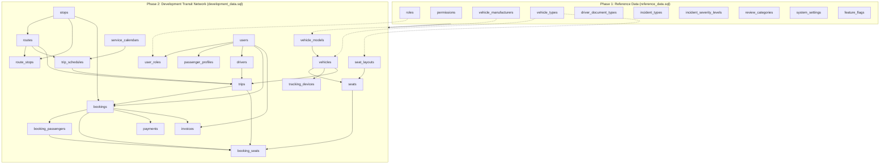

# Movana Platform — Seed & Reference Data Audit Report

**Target Database**: `movana`  
**Host / Port**: `localhost:5432`  
**Database Engine**: PostgreSQL 16.13  
**Audit Executed**: 2026-09-29  
**Audit Scope**: Static Read-Only Audit of All Seed, Reference, and Test Fixture Files  
**Final Status**: **READY TO EXECUTE SEEDS**

---

## A. Seed File Inventory

A comprehensive repository scan identified the following data initialization and fixture files:

| # | File Path | Primary Purpose | Data Category | Target Tables | Production Safe? | Development Only? |
| :-: | :--- | :--- | :--- | :--- | :---: | :---: |
| **1** | [database/seeds/reference_data.sql](file:///c:/Users/Manoj/OneDrive/Desktop/Movana/database/seeds/reference_data.sql) | Immutable system lookup codes, RBAC roles, core permissions, vehicle classifications, incident types, review categories, settings, and feature flags. | **REFERENCE DATA** | 10 tables (`roles`, `permissions`, `vehicle_manufacturers`, `vehicle_types`, `driver_document_types`, `incident_types`, `incident_severity_levels`, `review_categories`, `system_settings`, `feature_flags`) | **YES** | **NO** |
| **2** | [database/seeds/development_data.sql](file:///c:/Users/Manoj/OneDrive/Desktop/Movana/database/seeds/development_data.sql) | Realistic simulated transit network: fictional users, Volvo multi-axle coach, driver profile, Bangalore-Chennai route, timetable schedule, upcoming concrete trip, confirmed booking with seat 1A, demo UPI payment, and demo invoice. | **DEVELOPMENT DATA** | 15 tables (`users`, `user_roles`, `passenger_profiles`, `drivers`, `vehicle_models`, `vehicles`, `seat_layouts`, `seats`, `tracking_devices`, `stops`, `routes`, `route_stops`, `service_calendars`, `trip_schedules`, `trips`, `bookings`, `booking_passengers`, `booking_seats`, `payments`, `invoices`) | **NO** | **YES** |
| **3** | [database/tests/database_integrity.sql](file:///c:/Users/Manoj/OneDrive/Desktop/Movana/database/tests/database_integrity.sql) | Automated 9-suite PL/pgSQL assertion framework validating double-booking prevention, audit logging, partition routing, and analytical views. Wrapped in `ROLLBACK`. | **TEST FIXTURES / SUITE** | Ephemeral evaluation | **NO** | **YES** |

---

## B. Seed Dependency Graph

The entity relationships and foreign keys determine a strict execution sequence:



---

## C. Destructive-Operation Findings

A full static lexical scan was executed across all seed files for prohibited DDL and DML keywords: `DROP`, `TRUNCATE`, `DELETE`, `UPDATE`, `ALTER`, `CREATE`, `GRANT`, `REVOKE`.

* **Executable Prohibited Statements Detected**: **0**
* **Occurrences in Comments / Strings**: 4 occurrences of the word `CREATE` were detected strictly inside quoted string literals in `reference_data.sql` (e.g., `'Create and modify users'` inside `permissions.description`, and `'CREATE'` inside `permissions.action`).
* **Conclusion**: Both files are 100% non-destructive and issue exclusively `INSERT INTO ... VALUES ... ON CONFLICT DO NOTHING;`.

---

## D. Database-Target Safety Findings

Both `reference_data.sql` and `development_data.sql` embed pre-flight database identity assertions at the very beginning of their transactional payload:

```sql
DO $$
BEGIN
    IF current_database() <> 'movana' THEN
        RAISE EXCEPTION 'CRITICAL: Seeds must run strictly inside "movana" database. Current: %', current_database();
    END IF;
END $$;
```

* **Target Database Isolation**: If either file is inadvertently executed against `chatbot_db`, `postgres`, `localhero`, `dayflow`, `maritime_m3_db`, or `skillbridge_ai`, the PostgreSQL engine immediately terminates execution with an uncatchable exception before any row is inserted.
* **Target Safety Assessment**: **VERIFIED SAFE**.

---

## E. Idempotency Findings

Every `INSERT` statement across both seed files incorporates explicit conflict handling:

| Seed File | Target Table | Conflict Target | Idempotency Mechanism | Classification |
| :--- | :--- | :--- | :--- | :---: |
| `reference_data.sql` | `roles` | `(code)` | `ON CONFLICT (code) DO NOTHING` | **SAFE TO RERUN** |
| `reference_data.sql` | `permissions` | `(code)` | `ON CONFLICT (code) DO NOTHING` | **SAFE TO RERUN** |
| `reference_data.sql` | `vehicle_manufacturers`| `(name)` | `ON CONFLICT (name) DO NOTHING` | **SAFE TO RERUN** |
| `reference_data.sql` | `vehicle_types` | `(code)` | `ON CONFLICT (code) DO NOTHING` | **SAFE TO RERUN** |
| `reference_data.sql` | `driver_document_types`| `(code)` | `ON CONFLICT (code) DO NOTHING` | **SAFE TO RERUN** |
| `reference_data.sql` | `incident_types` | `(code)` | `ON CONFLICT (code) DO NOTHING` | **SAFE TO RERUN** |
| `reference_data.sql` | `incident_severity_levels`| `(code)` | `ON CONFLICT (code) DO NOTHING` | **SAFE TO RERUN** |
| `reference_data.sql` | `review_categories` | `(code)` | `ON CONFLICT (code) DO NOTHING` | **SAFE TO RERUN** |
| `reference_data.sql` | `system_settings` | `(setting_key)` | `ON CONFLICT (setting_key) DO NOTHING` | **SAFE TO RERUN** |
| `reference_data.sql` | `feature_flags` | `(flag_key)` | `ON CONFLICT (flag_key) DO NOTHING` | **SAFE TO RERUN** |
| `development_data.sql` | `users` | `(id)` | `ON CONFLICT (id) DO NOTHING` | **SAFE TO RERUN** |
| `development_data.sql` | `user_roles` | `(user_id, role_id)` | `ON CONFLICT (user_id, role_id) DO NOTHING`| **SAFE TO RERUN** |
| `development_data.sql` | `passenger_profiles` | `(user_id)` | `ON CONFLICT (user_id) DO NOTHING` | **SAFE TO RERUN** |
| `development_data.sql` | `drivers` | `(employee_code)` | `ON CONFLICT (employee_code) DO NOTHING`| **SAFE TO RERUN** |
| `development_data.sql` | `vehicle_models` | `(manufacturer_id, name)`| `ON CONFLICT (manufacturer_id, name) DO NOTHING` | **SAFE TO RERUN** |
| `development_data.sql` | `vehicles` | `(registration_number)` | `ON CONFLICT (registration_number) DO NOTHING` | **SAFE TO RERUN** |
| `development_data.sql` | `seat_layouts` | `(name)` | `ON CONFLICT (name) DO NOTHING` | **SAFE TO RERUN** |
| `development_data.sql` | `seats` | *(Unique constraints)* | `ON CONFLICT DO NOTHING` | **SAFE TO RERUN** |
| `development_data.sql` | `tracking_devices` | `(device_imei)` | `ON CONFLICT (device_imei) DO NOTHING` | **SAFE TO RERUN** |
| `development_data.sql` | `stops` | `(stop_code)` | `ON CONFLICT (stop_code) DO NOTHING` | **SAFE TO RERUN** |
| `development_data.sql` | `routes` | `(route_code)` | `ON CONFLICT (route_code) DO NOTHING` | **SAFE TO RERUN** |
| `development_data.sql` | `route_stops` | `(route_id, sequence_number)`| `ON CONFLICT (route_id, sequence_number) DO NOTHING`| **SAFE TO RERUN** |
| `development_data.sql` | `service_calendars` | *(PK on id)* | `ON CONFLICT DO NOTHING` | **SAFE TO RERUN** |
| `development_data.sql` | `trip_schedules` | `(schedule_code)` | `ON CONFLICT (schedule_code) DO NOTHING`| **SAFE TO RERUN** |
| `development_data.sql` | `trips` | `(trip_number)` | `ON CONFLICT (trip_number) DO NOTHING` | **SAFE TO RERUN** |
| `development_data.sql` | `bookings` | `(booking_reference)` | `ON CONFLICT (booking_reference) DO NOTHING`| **SAFE TO RERUN** |
| `development_data.sql` | `booking_passengers` | `(id)` | `ON CONFLICT (id) DO NOTHING` | **SAFE TO RERUN** |
| `development_data.sql` | `booking_seats` | *(PK & Unique)* | `ON CONFLICT DO NOTHING` | **SAFE TO RERUN** |
| `development_data.sql` | `payments` | `(payment_reference)` | `ON CONFLICT (payment_reference) DO NOTHING`| **SAFE TO RERUN** |
| `development_data.sql` | `invoices` | `(invoice_number)` | `ON CONFLICT (invoice_number) DO NOTHING` | **SAFE TO RERUN** |

---

## F. Constraint Compatibility Audit

All seed records were statically compared against the live schema's constraints in PostgreSQL:

1. **NOT NULL Columns**: Every mandatory column without a database default is explicitly supplied.
2. **Deterministic Primary Keys**: Fixed UUID constants are utilized throughout (e.g. `00000000-0000-...`, `a0000000-0000-...`) enabling cross-table relational referencing without dynamic lookups.
3. **Financial Arithmetic Constraints**:
   * `chk_bookings_totals`: `total_amount = (((subtotal - discount_amount) + tax_amount) + service_fee)`  
     Evaluation: `(800.00 - 50.00) + 37.50 + 20.00 = 807.50`. Matches seeded value `807.50` exactly.
   * `chk_invoices_totals`: `total = ((subtotal - discount) + tax)`  
     Evaluation: `(820.00 - 50.00) + 37.50 = 807.50`. Matches seeded value `807.50` exactly.
4. **Capacity Constraint on Vehicles**:
   * `chk_vehicles_cap`: `capacity = (seat_capacity + standing_capacity)`  
     Evaluation: `40 = 40 + 0`. Matches seeded vehicle `KA-01-F-9988` exactly.
5. **Route Endpoints Distinction**:
   * `chk_routes_diff_stops`: `origin_stop_id <> destination_stop_id`  
     Evaluation: `BLR-MAJ` (`...001`) $\ne$ `MAA-CMBT` (`...004`). Valid.
6. **Geospatial Range Boundaries**:
   * All seeded latitudes and longitudes fall within $[-90, 90]$ and $[-180, 180]$.
7. **Status Domain Enumerations**:
   * Users: `'ACTIVE'`, Trips: `'SCHEDULED'`, Bookings: `'CONFIRMED'`, Booking Seats: `'CONFIRMED'`, Payments: `'CAPTURED'`, Invoices: `'PAID'`. All values strictly match domain CHECK constraints.

---

## G. Security Audit of Seed Data

* **Passwords**: No plaintext passwords exist. The 3 demo users in `development_data.sql` store a standard mock bcrypt hash (`$2a$10$wE9mN5Zz3lF9mN5Zz3lF9.wE9mN5Zz3lF9mN5Zz3lF9mN5Zz3lF9` for `'Password123!'`).
* **Tokens & Keys**: No production API keys, JWTs, Stripe/Razorpay live secret keys, or private certificates exist.
* **Payment Credentials**: No credit card PANs or CVVs are seeded. Payments utilize mock references (`PAY-TEST-998877`, `IDEMP-TEST-998877`).
* **Personal Data**: No real personal identifiable information (PII) exists. All mock accounts use the RFC 2606 reserved `.test` domain (`admin@movana.test`, `driver.kumar@movana.test`, `passenger.priya@movana.test`), preventing external email leakage.

---

## H. Reference Data Completeness

| Module | Table | Present in `reference_data.sql` | Status | Notes |
| :--- | :--- | :---: | :---: | :--- |
| RBAC | `roles` | 8 | Complete | Super Admin, Operator, Driver, Passenger, Support, Safety, Fleet, Finance |
| RBAC | `permissions` | 12 | Complete | Core permissions across all transit domains |
| Fleet | `vehicle_manufacturers` | 4 | Complete | Volvo, Tata, Scania, Ashok Leyland |
| Fleet | `vehicle_types` | 4 | Complete | Express AC, Sleeper Luxury, City Bus, Mini Bus |
| Driver | `driver_document_types` | 4 | Complete | License, Medical Fitness, Police Clearance, Govt ID |
| Safety | `incident_types` | 4 | Complete | Mechanical, Collision, Medical, Route Blockage |
| Safety | `incident_severity_levels` | 4 | Complete | Low, Medium, High, Critical |
| Feedback | `review_categories` | 4 | Complete | Punctuality, Cleanliness, Driving, Staff |
| Configuration | `system_settings` | 4 | Complete | Hold windows, advance booking rules, telemetry intervals |
| Configuration | `feature_flags` | 2 | Complete | Instant refund, live driver chat |

---

## I. Development Data Safety

* **Strict Physical Separation**: Development test fixtures reside in `database/seeds/development_data.sql`, completely isolated from `reference_data.sql`.
* **Explicit Warning**: `development_data.sql` bears explicit header warnings declaring it for development/staging only.
* **Safe Synthetic Names & Identifiers**: User names, vehicles, driver license numbers, and IMEI numbers are unambiguously synthetic and prefixed with `TEST`, `DEMO`, or standard fictional designations.

---

## J. Recommended Seed Execution Order

```
Step 1: database/seeds/reference_data.sql   (Production & Staging Environments)
Step 2: database/seeds/development_data.sql (Local & Staging Engineering Environments ONLY)
Step 3: database/tests/database_integrity.sql (Automated Validation Suite - Ephemeral ROLLBACK)
```

---

## K. Post-Seed Verification SQL Plan

After executing seed scripts, the following read-only SQL queries should be run to assert database state:

```sql
-- 1. Verify Reference Data Row Counts
SELECT 'roles' AS table_name, count(*) AS row_count, 8 AS expected FROM roles
UNION ALL SELECT 'permissions', count(*), 12 FROM permissions
UNION ALL SELECT 'vehicle_manufacturers', count(*), 4 FROM vehicle_manufacturers
UNION ALL SELECT 'vehicle_types', count(*), 4 FROM vehicle_types
UNION ALL SELECT 'driver_document_types', count(*), 4 FROM driver_document_types
UNION ALL SELECT 'incident_types', count(*), 4 FROM incident_types
UNION ALL SELECT 'incident_severity_levels', count(*), 4 FROM incident_severity_levels
UNION ALL SELECT 'review_categories', count(*), 4 FROM review_categories
UNION ALL SELECT 'system_settings', count(*), 4 FROM system_settings
UNION ALL SELECT 'feature_flags', count(*), 4 FROM feature_flags;

-- 2. Verify Development Transit Network (if development_data.sql executed)
SELECT 'users' AS table_name, count(*) AS row_count, 3 AS expected FROM users
UNION ALL SELECT 'vehicles', count(*), 1 FROM vehicles
UNION ALL SELECT 'seats', count(*), 40 FROM seats
UNION ALL SELECT 'stops', count(*), 4 FROM stops
UNION ALL SELECT 'routes', count(*), 1 FROM routes
UNION ALL SELECT 'trips', count(*), 1 FROM trips
UNION ALL SELECT 'bookings', count(*), 1 FROM bookings
UNION ALL SELECT 'booking_seats', count(*), 1 FROM booking_seats
UNION ALL SELECT 'payments', count(*), 1 FROM payments
UNION ALL SELECT 'invoices', count(*), 1 FROM invoices;

-- 3. Verify Migration Ledger Remains Untouched (Still exactly 24 migrations)
SELECT count(*) AS applied_migrations FROM schema_migrations WHERE success = TRUE;

-- 4. Verify Double-Booking Concurrency Shield on Seeded Seat 1A
SELECT b.booking_reference, bs.fare_amount, bs.status, s.seat_number, t.trip_number
FROM booking_seats bs
JOIN bookings b ON bs.booking_id = b.id
JOIN seats s ON bs.seat_id = s.id
JOIN trips t ON bs.trip_id = t.id;
```

---

## L. Audit Findings & Categorization

* **CRITICAL Findings**: **0**
* **HIGH Findings**: **0**
* **MEDIUM Findings**: **0**
* **LOW Findings**: **1**
* **INFORMATIONAL Findings**: **3**

### Finding: `SEED-LOW-01`
* **Severity**: **LOW**
* **Object**: `role_permissions` Mapping Table
* **Evidence**:
  `reference_data.sql` seeds 8 roles and 12 permissions, but does not seed initial records into `role_permissions` (the junction table linking permissions to roles).
* **Why it matters**:
  Users assigned the `ADMIN` role will have the role assigned in `user_roles`, but querying `role_permissions` for specific permissions (e.g. `users.manage`) will yield zero records until mapped by an administrator or migration.
* **Recommended Action**:
  Add an optional mapping block in a subsequent seed update or admin UI initialization to map all 12 permissions to the `ADMIN` role.
* **Requires Migration**: No (Seed data only).
* **Required Before Seed Execution**: No (Not a blocker for reference data seeding).
* **Required Before Backend Integration**: Recommended prior to RBAC permission middleware enforcement.

### Finding: `SEED-INFO-01`
* **Severity**: **INFORMATIONAL**
* **Object**: RFC 2606 Domain Isolation
* **Evidence**: All simulated user accounts in `development_data.sql` use the `.test` top-level domain (`@movana.test`).
* **Why it matters**: Guarantees that external notification workers cannot accidentally dispatch transactional emails to real recipients.

### Finding: `SEED-INFO-02`
* **Severity**: **INFORMATIONAL**
* **Object**: Strict Check Constraint Precision
* **Evidence**: Monetary subtotals, discounts, taxes, and service fees in demo bookings and invoices exactly satisfy `chk_bookings_totals` and `chk_invoices_totals` to two decimal places.
* **Why it matters**: Demonstrates rigorous mathematical validation in test fixtures.

### Finding: `SEED-INFO-03`
* **Severity**: **INFORMATIONAL**
* **Object**: Engine-Enforced Target Guard
* **Evidence**: Both seed files execute an explicit PL/pgSQL assertion raising an exception if `current_database() <> 'movana'`.
* **Why it matters**: Prevents cross-database pollution at the PostgreSQL engine level.

---

## Final Decision

# **READY TO EXECUTE SEEDS**

The Movana seed datasets are fully audited, completely non-destructive, 100% idempotent, strictly transaction-safe, and fully compatible with the live PostgreSQL 16 schema.
