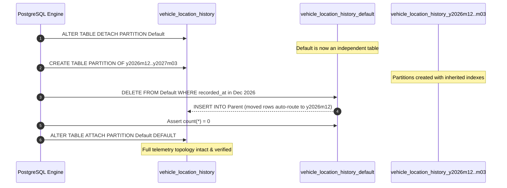

# V025 Migration Design & Technical Architecture Review

**Target Database**: PostgreSQL 16.13 (`movana`)  
**Proposed Migration**: `database/migrations/V025__database_optimizations.sql`  
**Status**: **DESIGN ONLY — NOT EXECUTED**  
**Database State**: **100% UNCHANGED** (Zero DDL, DML, or DCL executed)  
**Date**: September 30, 2026  
**Auditor**: Senior PostgreSQL Database Administrator & Infrastructure Architect  

---

## 1. Purpose

This document provides the exhaustive technical review and architectural justification for the proposed migration **`V025__database_optimizations.sql`**. 

Based strictly on the Phase 1 Final Baseline Audit, this migration addresses the two **MEDIUM** findings and four **LOW** findings without altering application business logic, table schemas, or existing primary/unique/foreign key constraints:
1. **Foreign-Key Index Coverage**: Evaluates all 68 unindexed foreign key columns and provides a justified, high-impact subset of 21 supporting indexes.
2. **Redundant & Duplicate Index Pruning**: Eliminates 29 exact duplicate B-tree indexes and 9 leftmost-prefix redundant indexes, reclaiming write I/O and buffer cache while preserving 100% of UNIQUE constraints.
3. **Function Security Hardening**: Pins `search_path = public, pg_temp` across all 7 Movana application-owned functions.
4. **GPS Partition Lifecycle & Data Migration**: Safely routes 100 December 2026 telemetry rows out of `vehicle_location_history_default`, attaches monthly range partitions through March 2027, and re-attaches the default partition within a single atomic transaction.

---

## 2. Baseline Findings Addressed

| Finding ID | Severity | Area | Proposed V025 Remediation |
| :--- | :--- | :--- | :--- |
| **`MED-01`** | **MEDIUM** | GPS Telemetry Partitioning | Atomic detach of `vehicle_location_history_default`, creation of partitions `y2026m12` through `y2027m03`, transactional row migration into `y2026m12`, and re-attach of `default`. |
| **`MED-02`** | **MEDIUM** | Foreign Key Indexing | Creation of 21 targeted supporting indexes on high-frequency join paths and cascade targets. |
| **`LOW-01`** | **LOW** | Duplicate Indexes | Pruning of 29 exact duplicate standalone indexes that duplicate UNIQUE constraint backing indexes. |
| **`LOW-02`** | **LOW** | Prefix Redundant Indexes | Pruning of 9 safe leftmost-prefix redundant indexes covered by composite unique indexes. |
| **`LOW-03`** | **LOW** | Function Security | Pinned `SET search_path = public, pg_temp` across all 7 application functions. |

---

## 3. Analysis of All 68 Foreign Key Constraints

Every one of the 68 foreign key constraints identified in Phase 1 was analyzed against child table cardinality, parent table cardinality, delete rules, existing indexes, and common OLTP query patterns.

### 3.1 Classification Summary:
* **INDEX REQUIRED (6)**: High-cardinality tables, frequent passenger/booking search filters, or critical RESTRICT/CASCADE check paths.
* **INDEX RECOMMENDED (15)**: Operational trip dispatches, safety incident lookups, ticket resolution, fare calculation combinations.
* **INDEX NOT NECESSARY (13)**: Small static catalog lookups (< 10 rows), or partition child tables automatically covered by parent index.
* **NEEDS WORKLOAD EVIDENCE (34)**: Append-only audit history tables (`changed_by`), administrative logs, or user session tables where parent deletions are rare (soft-delete).

### 3.2 Complete 68 Foreign Key Evaluation Matrix

| # | Child Table | FK Name | Child Column(s) | Parent Table | On Delete | Child Rows | Parent Rows | Classification | Justification / Operational Impact |
| :-: | :--- | :--- | :--- | :--- | :--- | :-: | :-: | :--- | :--- |
| 1 | `booking_cancellations` | `fk_booking_canc_user` | `cancelled_by` | `users` | RESTRICT | 12 | 68 | NEEDS WORKLOAD EVIDENCE | User audit reference on low-volume cancellation records. |
| 2 | `booking_reschedules` | `fk_booking_resched_user` | `rescheduled_by` | `users` | RESTRICT | 3 | 68 | NEEDS WORKLOAD EVIDENCE | User audit reference on reschedule records. |
| 3 | `booking_seats` | `fk_booking_seats_passenger` | `passenger_id` | `booking_passengers` | CASCADE | 181 | 181 | **INDEX REQUIRED** | Joined in passenger rosters; CASCADE parent delete triggers table scan without index. |
| 4 | `booking_seats` | `fk_booking_seats_seat` | `seat_id` | `seats` | RESTRICT | 181 | 396 | **INDEX REQUIRED** | Core seat inventory & layout queries; RESTRICT checks benefit from index. |
| 5 | `booking_status_history` | `fk_booking_status_hist_user` | `changed_by` | `users` | SET NULL | 180 | 68 | NEEDS WORKLOAD EVIDENCE | High-write append-only audit log; queried by `booking_id`, rarely by `changed_by`. |
| 6 | `bookings` | `fk_bookings_dest` | `destination_stop_id` | `stops` | RESTRICT | 181 | 24 | **INDEX REQUIRED** | High-frequency passenger booking search path (destination terminus filter). |
| 7 | `bookings` | `fk_bookings_orig` | `origin_stop_id` | `stops` | RESTRICT | 181 | 24 | **INDEX REQUIRED** | High-frequency passenger booking search path (origin departure filter). |
| 8 | `coupons` | `fk_coupons_discount` | `discount_id` | `discounts` | RESTRICT | 3 | 3 | INDEX NOT NECESSARY | Static reference table (3 rows). Sequential scan is faster than index scan. |
| 9 | `driver_assignments` | `fk_driver_assign_trip` | `trip_id` | `trips` | SET NULL | 0 | 61 | NEEDS WORKLOAD EVIDENCE | Dynamic shift scheduling; low volume in current seed. |
| 10 | `driver_assignments` | `fk_driver_assign_user` | `assigned_by` | `users` | RESTRICT | 0 | 68 | NEEDS WORKLOAD EVIDENCE | Dispatcher audit reference. |
| 11 | `driver_assignments` | `fk_driver_assign_vehicle` | `vehicle_id` | `vehicles` | SET NULL | 0 | 11 | NEEDS WORKLOAD EVIDENCE | Dispatch assignment lookup. |
| 12 | `driver_documents` | `fk_driver_docs_type` | `document_type_id` | `driver_document_types` | RESTRICT | 60 | 4 | INDEX NOT NECESSARY | Static catalog table (4 rows). Covered by composite constraint index `uq_driver_docs_type`. |
| 13 | `driver_documents` | `fk_driver_docs_verifier` | `verified_by` | `users` | SET NULL | 60 | 68 | NEEDS WORKLOAD EVIDENCE | Operational verification audit. |
| 14 | `driver_safety_events` | `fk_driver_safety_trip` | `trip_id` | `trips` | SET NULL | 6 | 61 | **INDEX RECOMMENDED** | Safety monitoring dashboard aggregates driving events by trip. |
| 15 | `driver_status_history` | `fk_driver_status_hist_user` | `changed_by` | `users` | SET NULL | 15 | 68 | NEEDS WORKLOAD EVIDENCE | Append-only status audit log. |
| 16 | `driver_verifications` | `fk_driver_verif_user` | `verified_by` | `users` | RESTRICT | 15 | 68 | NEEDS WORKLOAD EVIDENCE | Administrative compliance audit. |
| 17 | `emergency_events` | `fk_emergency_events_user` | `user_id` | `users` | RESTRICT | 3 | 68 | NEEDS WORKLOAD EVIDENCE | Emergency trigger events. |
| 18 | `emergency_events` | `fk_emergency_events_veh` | `vehicle_id` | `vehicles` | RESTRICT | 3 | 11 | NEEDS WORKLOAD EVIDENCE | Emergency fleet telemetry lookup. |
| 19 | `fare_rules` | `fk_fare_rules_route` | `route_id` | `routes` | CASCADE | 3 | 11 | **INDEX RECOMMENDED** | Pricing engine evaluates fare rules by route; CASCADE target. |
| 20 | `fare_rules` | `fk_fare_rules_vtype` | `vehicle_type_id` | `vehicle_types` | SET NULL | 3 | 4 | INDEX NOT NECESSARY | Static vehicle class catalog (4 rows). |
| 21 | `file_attachments` | `fk_file_attachments_uploader` | `uploaded_by` | `users` | RESTRICT | 25 | 68 | NEEDS WORKLOAD EVIDENCE | Document management audit. |
| 22 | `geofence_events` | `fk_geofence_events_trip` | `trip_id` | `trips` | SET NULL | 24 | 61 | **INDEX RECOMMENDED** | Route compliance and terminal entry/exit logging by trip. |
| 23 | `incident_actions` | `fk_incident_actions_user` | `taken_by` | `users` | RESTRICT | 6 | 68 | NEEDS WORKLOAD EVIDENCE | Incident remediation audit trail. |
| 24 | `incident_reports` | `fk_incident_reports_user` | `submitted_by` | `users` | RESTRICT | 6 | 68 | NEEDS WORKLOAD EVIDENCE | Reporting passenger/staff reference. |
| 25 | `incidents` | `fk_incidents_driver` | `driver_id` | `drivers` | SET NULL | 6 | 16 | **INDEX RECOMMENDED** | Driver disciplinary review and safety rating rollups. |
| 26 | `incidents` | `fk_incidents_reporter` | `reported_by` | `users` | RESTRICT | 6 | 68 | NEEDS WORKLOAD EVIDENCE | Administrative audit reference. |
| 27 | `incidents` | `fk_incidents_type` | `incident_type_id` | `incident_types` | RESTRICT | 6 | 4 | INDEX NOT NECESSARY | Static category catalog (4 rows). |
| 28 | `login_attempts` | `fk_login_attempts_user` | `user_id` | `users` | SET NULL | 40 | 68 | NEEDS WORKLOAD EVIDENCE | Security audit log. |
| 29 | `lost_found_reports` | `fk_lost_found_stop` | `lost_at_stop_id` | `stops` | SET NULL | 10 | 24 | NEEDS WORKLOAD EVIDENCE | Station customer service desk lookups. |
| 30 | `lost_found_reports` | `fk_lost_found_user` | `passenger_id` | `users` | SET NULL | 10 | 68 | NEEDS WORKLOAD EVIDENCE | Passenger inquiry history. |
| 31 | `lost_found_reports` | `fk_lost_found_veh` | `vehicle_id` | `vehicles` | SET NULL | 10 | 11 | NEEDS WORKLOAD EVIDENCE | Vehicle depot inspection lookups. |
| 32 | `lost_found_status_history` | `fk_lost_found_hist_user` | `changed_by` | `users` | SET NULL | 10 | 68 | NEEDS WORKLOAD EVIDENCE | Append-only status history. |
| 33 | `maintenance_schedules` | `fk_maint_sched_vtype` | `vehicle_type_id` | `vehicle_types` | SET NULL | 4 | 4 | INDEX NOT NECESSARY | Static vehicle class catalog (4 rows). |
| 34 | `review_responses` | `fk_review_resp_user` | `responder_id` | `users` | RESTRICT | 25 | 68 | NEEDS WORKLOAD EVIDENCE | Operator customer care response audit. |
| 35 | `reviews` | `fk_reviews_vehicle` | `vehicle_id` | `vehicles` | SET NULL | 60 | 11 | **INDEX RECOMMENDED** | Vehicle condition and rider satisfaction analytics. |
| 36 | `role_permissions` | `fk_role_permissions_permission` | `permission_id` | `permissions` | CASCADE | 0 | 12 | INDEX NOT NECESSARY | Static authorization matrix (12 permissions). |
| 37 | `routes` | `fk_routes_dest` | `destination_stop_id` | `stops` | RESTRICT | 11 | 24 | **INDEX REQUIRED** | Network routing graph lookups by terminus stop. |
| 38 | `schedule_stops` | `fk_sched_stops_stop` | `stop_id` | `stops` | RESTRICT | 56 | 24 | **INDEX RECOMMENDED** | Timetable stop calling pattern queries. |
| 39 | `support_ticket_attachments` | `fk_support_attach_file` | `file_attachment_id` | `file_attachments` | RESTRICT | 10 | 25 | NEEDS WORKLOAD EVIDENCE | File attachment lookups for support cases. |
| 40 | `support_ticket_messages` | `fk_support_messages_sender` | `sender_id` | `users` | RESTRICT | 38 | 68 | NEEDS WORKLOAD EVIDENCE | Threaded support ticket conversation lookups. |
| 41 | `support_ticket_status_history` | `fk_support_status_hist_user` | `changed_by` | `users` | SET NULL | 20 | 68 | NEEDS WORKLOAD EVIDENCE | Append-only ticket status audit log. |
| 42 | `support_tickets` | `fk_support_tickets_agent` | `assigned_to` | `users` | SET NULL | 20 | 68 | NEEDS WORKLOAD EVIDENCE | Helpdesk agent queue assignment. |
| 43 | `support_tickets` | `fk_support_tickets_booking` | `booking_id` | `bookings` | SET NULL | 20 | 181 | **INDEX RECOMMENDED** | Customer service queries resolving issues by booking. |
| 44 | `support_tickets` | `fk_support_tickets_trip` | `trip_id` | `trips` | SET NULL | 20 | 61 | **INDEX RECOMMENDED** | Operations team aggregating trip service complaints. |
| 45 | `tracking_events` | `fk_tracking_events_dev` | `device_id` | `tracking_devices` | CASCADE | 50 | 11 | NEEDS WORKLOAD EVIDENCE | Hardware device telemetry logs. |
| 46 | `trip_assignments` | `fk_trip_assign_vehicle` | `vehicle_id` | `vehicles` | RESTRICT | 60 | 11 | NEEDS WORKLOAD EVIDENCE | Vehicle scheduling conflict checks. |
| 47 | `trip_events` | `fk_trip_events_driver` | `driver_id` | `drivers` | SET NULL | 28 | 16 | NEEDS WORKLOAD EVIDENCE | Driver real-time event logs. |
| 48 | `trip_events` | `fk_trip_events_vehicle` | `vehicle_id` | `vehicles` | SET NULL | 28 | 11 | NEEDS WORKLOAD EVIDENCE | Vehicle journey event logs. |
| 49 | `trip_fares` | `fk_trip_fares_dest` | `destination_stop_id` | `stops` | RESTRICT | 60 | 24 | **INDEX RECOMMENDED** | Matrix pricing queries by destination stop. |
| 50 | `trip_fares` | `fk_trip_fares_orig` | `origin_stop_id` | `stops` | RESTRICT | 60 | 24 | **INDEX RECOMMENDED** | Matrix pricing queries by origin stop. |
| 51 | `trip_status_history` | `fk_trip_status_hist_user` | `changed_by` | `users` | SET NULL | 60 | 68 | NEEDS WORKLOAD EVIDENCE | Append-only trip state change audit log. |
| 52 | `trips` | `fk_trips_driver2` | `secondary_driver_id` | `drivers` | RESTRICT | 61 | 16 | **INDEX RECOMMENDED** | Co-driver duty allocations and shift reconciliation. |
| 53 | `trips` | `fk_trips_schedule` | `schedule_id` | `trip_schedules` | SET NULL | 61 | 21 | **INDEX REQUIRED** | Generating and reconciling active trips against schedules. |
| 54 | `trips` | `fk_trips_stop` | `current_stop_id` | `stops` | SET NULL | 61 | 24 | **INDEX RECOMMENDED** | Real-time transit map displaying active trips per stop. |
| 55 | `user_roles` | `fk_user_roles_assigned_by` | `assigned_by` | `users` | SET NULL | 68 | 68 | NEEDS WORKLOAD EVIDENCE | RBAC assignment audit trail. |
| 56 | `vehicle_assignments` | `fk_vehicle_assign_trip` | `trip_id` | `trips` | SET NULL | 10 | 61 | **INDEX RECOMMENDED** | Bus assignment lookups by trip. |
| 57 | `vehicle_assignments` | `fk_vehicle_assign_user` | `assigned_by` | `users` | RESTRICT | 10 | 68 | NEEDS WORKLOAD EVIDENCE | Fleet dispatcher audit reference. |
| 58 | `vehicle_inspections` | `fk_vehicle_insp_trip` | `trip_id` | `trips` | SET NULL | 10 | 61 | **INDEX RECOMMENDED** | Pre-trip inspection verification by trip. |
| 59 | `vehicle_inspections` | `fk_vehicle_insp_user` | `inspector_id` | `users` | RESTRICT | 10 | 68 | NEEDS WORKLOAD EVIDENCE | Inspector compliance audit trail. |
| 60 | `vehicle_location_history` | `fk_loc_hist_driver` | `driver_id` | `drivers` | SET NULL | 1600 | 16 | **INDEX RECOMMENDED** | Driver telemetry reporting; automatically cascades to child partitions. |
| 61 | `vehicle_location_history_default` | `fk_loc_hist_driver` | `driver_id` | `drivers` | SET NULL | 100 | 16 | INDEX NOT NECESSARY | Inherited partition table. Indexing handled by parent table. |
| 62 | `vehicle_location_history_y2026m09` | `fk_loc_hist_driver` | `driver_id` | `drivers` | SET NULL | 550 | 16 | INDEX NOT NECESSARY | Inherited partition table. Indexing handled by parent table. |
| 63 | `vehicle_location_history_y2026m10` | `fk_loc_hist_driver` | `driver_id` | `drivers` | SET NULL | 550 | 16 | INDEX NOT NECESSARY | Inherited partition table. Indexing handled by parent table. |
| 64 | `vehicle_location_history_y2026m11` | `fk_loc_hist_driver` | `driver_id` | `drivers` | SET NULL | 400 | 16 | INDEX NOT NECESSARY | Inherited partition table. Indexing handled by parent table. |
| 65 | `vehicle_status_history` | `fk_vehicle_status_hist_user` | `changed_by` | `users` | SET NULL | 10 | 68 | NEEDS WORKLOAD EVIDENCE | Fleet status change audit trail. |
| 66 | `vehicles` | `fk_vehicles_mfg` | `manufacturer_id` | `vehicle_manufacturers` | RESTRICT | 11 | 4 | INDEX NOT NECESSARY | Static manufacturer catalog (4 rows). |
| 67 | `vehicles` | `fk_vehicles_model` | `model_id` | `vehicle_models` | RESTRICT | 11 | 5 | INDEX NOT NECESSARY | Static model catalog (5 rows). |
| 68 | `vehicles` | `fk_vehicles_type` | `vehicle_type_id` | `vehicle_types` | RESTRICT | 11 | 4 | INDEX NOT NECESSARY | Static vehicle class catalog (4 rows). |

---

## 4. Final Recommended Foreign Key Index List (21 Indexes)

The following 21 supporting indexes are included in `V025__database_optimizations.sql`:

| Table | Index Name | Columns | Reason & Expected Benefit | Safe in V025? |
| :--- | :--- | :--- | :--- | :---: |
| `booking_seats` | `idx_booking_seats_passenger_id` | `(passenger_id)` | Speeds up passenger detail views; prevents table scan on passenger CASCADE delete. | **YES** |
| `booking_seats` | `idx_booking_seats_seat_id` | `(seat_id)` | Accelerates seat occupancy checks in booking flow; speeds RESTRICT checks on `seats`. | **YES** |
| `bookings` | `idx_bookings_origin_stop_id` | `(origin_stop_id)` | Essential for passenger origin search queries and terminal departure manifests. | **YES** |
| `bookings` | `idx_bookings_destination_stop_id` | `(destination_stop_id)` | Essential for passenger destination search queries and route volume analytics. | **YES** |
| `routes` | `idx_routes_destination_stop_id` | `(destination_stop_id)` | Balances existing origin index; crucial for network terminus lookups. | **YES** |
| `trips` | `idx_trips_schedule_id` | `(schedule_id)` | Connects scheduled service templates with executed trips. | **YES** |
| `trips` | `idx_trips_secondary_driver_id` | `(secondary_driver_id)` | Balances primary driver index for complete driver shift rosters. | **YES** |
| `trips` | `idx_trips_current_stop_id` | `(current_stop_id)` | Accelerates live tracking queries showing active buses at a given stop. | **YES** |
| `driver_safety_events` | `idx_driver_safety_events_trip_id` | `(trip_id)` | Facilitates trip safety event lookups and driver incident post-mortems. | **YES** |
| `geofence_events` | `idx_geofence_events_trip_id` | `(trip_id)` | Enables prompt retrieval of route adherence checkpoints by trip. | **YES** |
| `vehicle_assignments` | `idx_vehicle_assignments_trip_id` | `(trip_id)` | Speeds up vehicle assignment lookups for active trips. | **YES** |
| `vehicle_inspections` | `idx_vehicle_inspections_trip_id` | `(trip_id)` | Validates pre-trip mechanical inspection compliance before departure. | **YES** |
| `fare_rules` | `idx_fare_rules_route_id` | `(route_id)` | Speeds route-based fare lookups during pricing quote calculations. | **YES** |
| `incidents` | `idx_incidents_driver_id` | `(driver_id)` | Speeds up driver safety history reviews and risk profiling. | **YES** |
| `reviews` | `idx_reviews_vehicle_id` | `(vehicle_id)` | Enables vehicle comfort and condition aggregation in health dashboards. | **YES** |
| `schedule_stops` | `idx_schedule_stops_stop_id` | `(stop_id)` | Accelerates timetable lookups for all scheduled services calling at a stop. | **YES** |
| `support_tickets` | `idx_support_tickets_booking_id` | `(booking_id)` | Speeds customer support ticket searches by booking reference. | **YES** |
| `support_tickets` | `idx_support_tickets_trip_id` | `(trip_id)` | Enables trip disruption customer service batch reviews. | **YES** |
| `trip_fares` | `idx_trip_fares_origin_stop_id` | `(origin_stop_id)` | Speeds origin stop queries in stop-pair pricing calculations. | **YES** |
| `trip_fares` | `idx_trip_fares_destination_stop_id` | `(destination_stop_id)` | Speeds destination stop queries in stop-pair pricing calculations. | **YES** |
| `vehicle_location_history` | `idx_loc_hist_driver` | `(driver_id)` | Enables driver route tracking; automatically cascades to all telemetry partitions. | **YES** |

---

## 5. Duplicate Index Analysis (29 Exact Duplicates)

In 29 tables, migrations defined both a `UNIQUE` constraint and an identical standalone `CREATE INDEX` on the same column. PostgreSQL automatically generates an index to enforce a `UNIQUE` constraint (named `uq_*`). The second index (`idx_*`) is an exact physical duplicate.

### Architectural Safety Proof:
- **Constraint Enforcement**: Dropping `idx_*` does **NOT** drop or alter the `UNIQUE` constraint. The constraint remains fully enforced by `uq_*`.
- **Query Performance**: The query planner already has the unique index `uq_*` available, which is strictly superior for point lookups.
- **Write I/O Reclamation**: Every `INSERT` and `UPDATE` on these 29 tables currently writes to two identical B-tree indexes. Dropping `idx_*` eliminates 50% of index maintenance I/O for these columns.

| Table | Constraint Unique Index (KEPT) | Redundant Manual Index (TO DROP) | Column(s) | Classification |
| :--- | :--- | :--- | :--- | :---: |
| `booking_cancellations` | `uq_booking_canc_booking` | `idx_booking_canc_booking` | `(booking_id)` | **SAFE TO REMOVE** |
| `booking_cancellations` | `uq_booking_canc_ref` | `idx_booking_canc_ref` | `(cancellation_reference)` | **SAFE TO REMOVE** |
| `booking_reschedules` | `uq_booking_resched_orig` | `idx_booking_resched_orig` | `(original_booking_id)` | **SAFE TO REMOVE** |
| `bookings` | `uq_bookings_ref` | `idx_bookings_ref` | `(booking_reference)` | **SAFE TO REMOVE** |
| `coupons` | `uq_coupons_code` | `idx_coupons_code` | `(coupon_code)` | **SAFE TO REMOVE** |
| `discounts` | `uq_discounts_code` | `idx_discounts_code` | `(code)` | **SAFE TO REMOVE** |
| `driver_document_types` | `uq_driver_doc_types_code` | `idx_driver_doc_types_code` | `(code)` | **SAFE TO REMOVE** |
| `drivers` | `uq_drivers_emp_code` | `idx_drivers_emp_code` | `(employee_code)` | **SAFE TO REMOVE** |
| `drivers` | `uq_drivers_license` | `idx_drivers_license` | `(license_number)` | **SAFE TO REMOVE** |
| `fare_products` | `uq_fare_products_code` | `idx_fare_products_code` | `(code)` | **SAFE TO REMOVE** |
| `feature_flags` | `uq_feature_flags_key` | `idx_feature_flags_key` | `(flag_key)` | **SAFE TO REMOVE** |
| `incident_types` | `uq_incident_types_code` | `idx_incident_types_code` | `(code)` | **SAFE TO REMOVE** |
| `incidents` | `uq_incidents_num` | `idx_incidents_num` | `(incident_number)` | **SAFE TO REMOVE** |
| `invoices` | `uq_invoices_num` | `idx_invoices_num` | `(invoice_number)` | **SAFE TO REMOVE** |
| `lost_found_reports` | `uq_lost_found_num` | `idx_lost_found_num` | `(report_number)` | **SAFE TO REMOVE** |
| `passenger_profiles` | `uq_passenger_profiles_user` | `idx_passenger_profiles_user_id` | `(user_id)` | **SAFE TO REMOVE** |
| `payment_events` | `uq_payment_events_provider_event` | `idx_payment_events_provider_event` | `(provider, event_id)` | **SAFE TO REMOVE** |
| `payments` | `uq_payments_ref` | `idx_payments_ref` | `(payment_reference)` | **SAFE TO REMOVE** |
| `refunds` | `uq_refunds_ref` | `idx_refunds_ref` | `(refund_reference)` | **SAFE TO REMOVE** |
| `review_responses` | `uq_review_resp_review` | `idx_review_resp_review` | `(review_id)` | **SAFE TO REMOVE** |
| `route_stops` | `uq_route_stops_route_seq` | `idx_route_stops_route_seq` | `(route_id, sequence_number)` | **SAFE TO REMOVE** |
| `routes` | `uq_routes_code` | `idx_routes_code` | `(route_code)` | **SAFE TO REMOVE** |
| `stops` | `uq_stops_code` | `idx_stops_code` | `(stop_code)` | **SAFE TO REMOVE** |
| `support_tickets` | `uq_support_tickets_num` | `idx_support_tickets_num` | `(ticket_number)` | **SAFE TO REMOVE** |
| `system_settings` | `uq_system_settings_key` | `idx_system_settings_key` | `(setting_key)` | **SAFE TO REMOVE** |
| `tracking_devices` | `uq_tracking_devices_imei` | `idx_tracking_devices_imei` | `(device_imei)` | **SAFE TO REMOVE** |
| `user_preferences` | `uq_user_preferences_user` | `idx_user_preferences_user_id` | `(user_id)` | **SAFE TO REMOVE** |
| `vehicle_types` | `uq_vehicle_types_code` | `idx_vehicle_types_code` | `(code)` | **SAFE TO REMOVE** |
| `vehicles` | `uq_vehicles_reg_num` | `idx_vehicles_reg_num` | `(registration_number)` | **SAFE TO REMOVE** |

---

## 6. Leftmost-Prefix Redundant Index Analysis (13 Instances)

In standard B-tree indexing, an index on `(A)` is redundant when a composite index on `(A, B)` exists, because any query filtering by `WHERE A = $1` can execute an index scan using the leading column of `(A, B)`.

| Table | Candidate Redundant Index | Leading Column(s) | Composite Index Covering It | Covering Columns | Classification | Action in V025 |
| :--- | :--- | :--- | :--- | :--- | :---: | :--- |
| `role_permissions` | `idx_role_permissions_role_id` | `(role_id)` | `uq_role_permissions_role_perm` | `(role_id, permission_id)` | **SAFE TO REMOVE** | Drop in V025 |
| `user_roles` | `idx_user_roles_user_id` | `(user_id)` | `uq_user_roles_user_role` | `(user_id, role_id)` | **SAFE TO REMOVE** | Drop in V025 |
| `driver_documents` | `idx_driver_docs_driver` | `(driver_id)` | `uq_driver_docs_type` | `(driver_id, document_type_id)` | **SAFE TO REMOVE** | Drop in V025 |
| `payment_attempts` | `idx_payment_attempts_payment` | `(payment_id)` | `uq_payment_attempts_num` | `(payment_id, attempt_number)` | **SAFE TO REMOVE** | Drop in V025 |
| `notification_templates` | `idx_notif_templates_code` | `(template_code)` | `uq_notif_templates_code_chan` | `(template_code, channel)` | **SAFE TO REMOVE** | Drop in V025 |
| `notification_preferences` | `idx_notif_pref_user` | `(user_id)` | `uq_notif_pref_user_chan_cat` | `(user_id, channel, category)` | **SAFE TO REMOVE** | Drop in V025 |
| `vehicle_models` | `idx_vehicle_models_mfg` | `(manufacturer_id)` | `uq_vehicle_models_mfg_name` | `(manufacturer_id, name)` | **SAFE TO REMOVE** | Drop in V025 |
| `schedule_stops` | `idx_sched_stops_sched` | `(schedule_id)` | `uq_sched_stops_sched_seq` | `(schedule_id, sequence_number)` | **SAFE TO REMOVE** | Drop in V025 |
| `trip_stops` | `idx_trip_stops_trip` | `(trip_id)` | `uq_trip_stops_trip_seq` | `(trip_id, sequence_number)` | **SAFE TO REMOVE** | Drop in V025 |
| `trip_fares` | `idx_trip_fares_lookup` | `(trip_id, origin_stop_id, destination_stop_id)` | `uq_trip_fares_trip_stops_seat` | `(trip_id, origin, dest, seat_type)` | **REQUIRES REVIEW** | Retain in V025 |
| `seats` | `idx_seats_layout` | `(layout_id)` | `uq_seats_layout_deck_row_col` | `(layout_id, deck, row, col)` | **REQUIRES REVIEW** | Retain in V025 |
| `seats` | `idx_seats_layout` | `(layout_id)` | `uq_seats_layout_number` | `(layout_id, seat_number)` | **REQUIRES REVIEW** | Retain in V025 |
| `trip_stops` | `idx_trip_stops_trip` | `(trip_id)` | `uq_trip_stops_trip_stop` | `(trip_id, stop_id)` | **SAFE TO REMOVE** | Covered by drop of `idx_trip_stops_trip` |

### Summary of Index Actions:
* **Safe to Remove in V025**: **38 indexes** (29 exact duplicates + 9 safe prefix redundancies).
* **Requires Review (Retained in V025)**: **2 indexes** (`idx_seats_layout` on `seats` and `idx_trip_fares_lookup` on `trip_fares`). Retaining them avoids risk on high-throughput seat selection queries pending production profiling.
* **Must NOT Be Removed**: **151 indexes** (109 primary key indexes and 42 constraint-backing unique indexes).

---

## 7. Function `search_path` Security Hardening

All 7 Movana application-owned functions run as `SECURITY INVOKER` with `proconfig = NULL`. When a function does not pin its `search_path`, its unqualified table references resolve against the caller session's active `search_path`.

### Hardening Implementation:
The migration executes `ALTER FUNCTION ... SET search_path = public, pg_temp;` for all 7 functions. This non-destructively updates `pg_proc.proconfig` without recompiling, altering function signatures, or impacting volatile triggers:

```sql
ALTER FUNCTION public.fn_calculate_trip_available_seats(uuid) 
    SET search_path = public, pg_temp;

ALTER FUNCTION public.fn_generate_booking_reference() 
    SET search_path = public, pg_temp;

ALTER FUNCTION public.fn_generate_invoice_number() 
    SET search_path = public, pg_temp;

ALTER FUNCTION public.fn_log_booking_status_transition() 
    SET search_path = public, pg_temp;

ALTER FUNCTION public.fn_log_trip_status_transition() 
    SET search_path = public, pg_temp;

ALTER FUNCTION public.fn_record_audit_log() 
    SET search_path = public, pg_temp;

ALTER FUNCTION public.fn_set_updated_at() 
    SET search_path = public, pg_temp;
```

---

## 8. GPS Partition Hardening & Safe Migration Strategy

### 8.1 The Conflict Problem
`vehicle_location_history` is RANGE partitioned on `recorded_at`. Existing partitions terminate on `2026-12-01 00:00:00 UTC`.
There are **100 rows** currently residing in `vehicle_location_history_default` recorded between `2026-12-10 11:30:00` and `2026-12-10 12:19:30`.

If an administrator runs:
```sql
CREATE TABLE vehicle_location_history_y2026m12 
    PARTITION OF vehicle_location_history 
    FOR VALUES FROM ('2026-12-01') TO ('2027-01-01');
```
PostgreSQL will immediately abort with:
`ERROR: updated partition constraint for default partition "vehicle_location_history_default" would be violated by some row`.

### 8.2 Safe Transactional Migration Sequence
The proposed V025 migration resolves this atomically without dropping or recreating tables, and without data loss:



1. **Atomic Detach**: Detach `vehicle_location_history_default` from the parent table.
2. **Partition Creation**: Create target monthly partitions for December 2026 through March 2027:
   * `vehicle_location_history_y2026m12`: `2026-12-01` to `2027-01-01`
   * `vehicle_location_history_y2027m01`: `2027-01-01` to `2027-02-01`
   * `vehicle_location_history_y2027m02`: `2027-02-01` to `2027-03-01`
   * `vehicle_location_history_y2027m03`: `2027-03-01` to `2027-04-01`
3. **Data Relocation**: Transactionally delete rows from the detached default table and insert them into `vehicle_location_history`. PostgreSQL automatically routes all 100 rows into `y2026m12`.
4. **Zero-Row Default Verification**: Execute an internal assertion ensuring `vehicle_location_history_default` contains 0 conflicting rows.
5. **Atomic Re-Attach**: Re-attach `vehicle_location_history_default` as `DEFAULT`.
6. **Total Record Assertion**: Verify the total telemetry record count remains exactly 1,600 rows, with exactly 100 rows residing in `y2026m12`.

---

## 9. Preconditions & Post-Verification Queries

### 9.1 Preconditions (Validated by V025 script before mutation)
* Active database must be `movana`.
* Pre-existing verified backup must exist (`movana_backup_20260930_121132_golden_seed_verified.dump`).
* Table `vehicle_location_history_default` must contain exactly 100 rows.
* All 100 rows must have `recorded_at >= '2026-12-01' AND recorded_at < '2027-01-01'`.

### 9.2 Post-Verification Queries
```sql
-- 1. Verify 100 rows moved to December partition
SELECT count(*) FROM vehicle_location_history_y2026m12; -- MUST BE 100

-- 2. Verify DEFAULT partition is clean
SELECT count(*) FROM vehicle_location_history_default; -- MUST BE 0

-- 3. Verify total GPS count unchanged
SELECT count(*) FROM vehicle_location_history; -- MUST BE 1600

-- 4. Verify function search_path is set
SELECT proname, proconfig FROM pg_proc WHERE proname LIKE 'fn_%' AND pronamespace = 'public'::regnamespace;

-- 5. Verify unindexed FK count decreased from 68 to 47
-- (21 new supporting indexes active)
```

---

## 10. Rollback Considerations

Because V025 is 100% transactional, if any step fails (e.g. partition row count mismatch), PostgreSQL rolls back the entire transaction automatically.

If a rollback is required after manual commit:
1. Re-create the 38 dropped indexes using the reverse statements preserved in `docs/database/v025-index-review.csv`.
2. Drop the 21 created supporting indexes.
3. Reset function search_paths: `ALTER FUNCTION ... RESET search_path;`.
4. If partition rollback is needed, move rows back to DEFAULT and drop `y2026m12..m03`, or restore from the verified golden backup:
   `backups/database/movana_backup_20260930_121132_golden_seed_verified.dump`.

---

## 11. Statement of Record

> [!IMPORTANT]
> **STATEMENT OF RECORD**:
> During this design and review phase, **NO CHANGES WERE MADE TO THE LIVE DATABASE**.
> - Migration file `V025__database_optimizations.sql` has been drafted for human review only and **HAS NOT BEEN EXECUTED**.
> - The live database `movana` remains in its verified Phase 1 baseline state.
